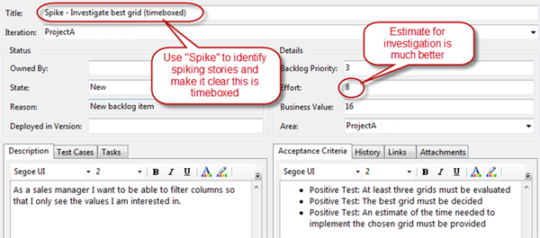

Sometimes it can be unclear to The Scrum Team whether a PBI can be completed as required.  For example the PBI "automatically package with Wise after the automatic build" requires investigation and experimentation to see if this is possible and to provide a meaningful estimate for the original.

<!--endintro-->

How is experimentation done? In Agile software development, when you have an unknown, you do a spike PBI.  A spike is a time boxed investigation with the output being the answer to an experiment or investigation and the resolution of an estimate for the original PBI.

It is then best to write a new PBI “Investigate whether it is possible to automatically build with Wise”.  This PBI can be more accurately estimated and the result will allow the original PBI to be estimated or revised.

[[badExample]]
| 

To embark on the original PBI when it is inestimable would be irresponsible and leave The Team with a potentially impossible PBI and the risk of a failed sprint.

All investigating PBIs must be timeboxed, otherwise the process of investigation can meander and never come to a conclusion.

[[goodExample]]
| (time boxed investigation) comes first as it is impossible to estimate implementing something you do not know**

Note: This gives you work for future Sprints

Tip: There is a further benefit of tagging 'spike' tasks with a consistent label. If your company takes up R & D tax incentives, then you need to be able to query for activities that were 'of an experimental nature'. In Australia this is a 15% credit on each dollar you spend on a developer.
