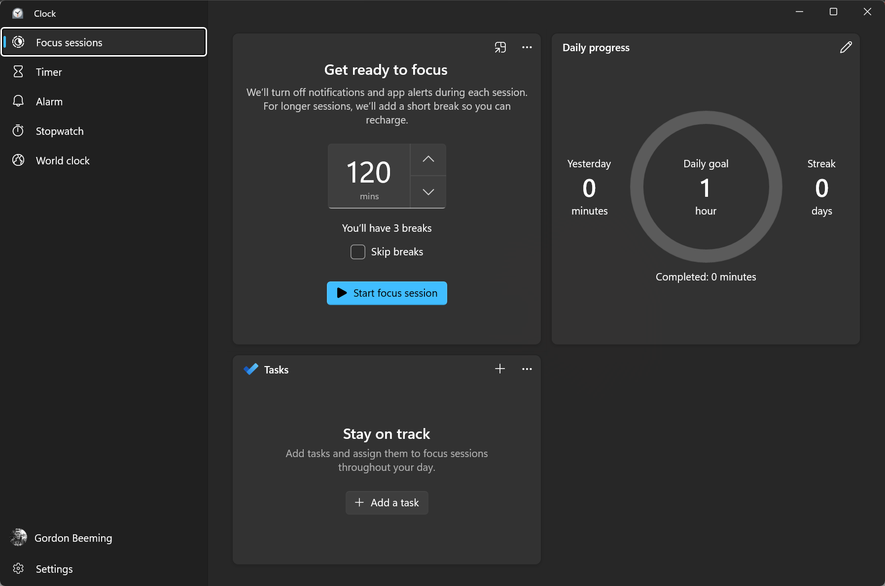

Getting difficult work done requires focus and there are many techniques to do that. This is why you should use the Pomodoro Technique.

<!--endintro-->

`youtube: https://youtu.be/1l4w7uHdNaQ`

**Video: The Pomodoro Technique - Study And Productivity Technique (animated) (5 min)**

The Pomodoro Technique is a time management method that was developed in the late 1980s by Francesco Cirillo. It is used to break up your work into intervals. By using a timer, you separate work intervals with short breaks. Each interval is known as a **pomodoro.**

A 25-minute Pomodoro session is considered by most long enough to get a little work done but not so long that it feels painful or overwhelming. However, it is possible to [experiment with the length of your pomodoros](https://todoist.com/productivity-methods/pomodoro-technique#experiment-with-the-length-of-your-pomodoros). Learn more on [The science behind the pomodoro technique](https://www.focusboosterapp.com/blog/the-science-behind-the-pomodoro-technique/).

`youtube: https://www.youtube.com/embed/-OYfOC2cXg0`

**Video: Do you use the Pomodoro Technique? (16 min)**

If you would like to find out more, check out [The Pomodoro® Technique website](https://www.pomodorotechnique.com/).

### The traditional technique uses 6 steps

1. Decide on the task to be done.
2. Set the pomodoro timer (Typically 25 minutes)
3. Work on the task
4. End work when the timer rings and take a short break (Typically 5-10 minutes)
5. If you have fewer than three pomodoros, go back to Step 2 and repeat until you go through all 3 pomodoros
6. After 3 pomodoros are done, take the 4th pomodoro and then take a long break (traditionally 20 to 30 minutes). Once the long break is finished, return to Step 2

### Use an app

A great application that encourages the use of the Pomodoro Technique is **Forest**.

* [Download - App Store](https://apps.apple.com/au/app/forest-stay-focused/id866450515)
* [Download - Google Play](https://play.google.com/store/apps/details?id=cc.forestapp&hl=en_AU&gl=US)

For those running Windows, you can [use focus sessions in Clock app](https://support.microsoft.com/en-us/windows/how-to-use-focus-in-windows-11-cbcc9ddb-8164-43fa-8919-b9a2af072382):

