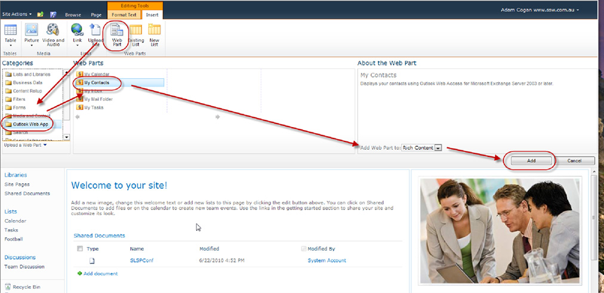
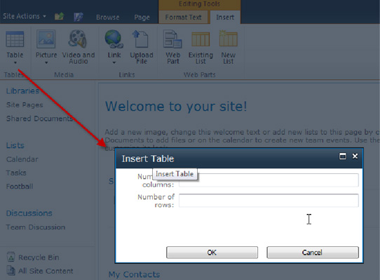

Some people like popup forms. Some do not.

Popup modal forms are no good:

* as you can't read or edit something else in a window behind
* as they take a lot of time to load in a browser (ask any CRM 4 user)

<!--endintro-->

Popup forms are good:

* as it is obvious you have an action step to perform before continuing
* as they simplify a form that has lots of fields
* if they can't get lost behind another window
* if you make them clear by dimming the background (see below)

<dl class="badImage">&lt;dt&gt;&lt;/dt&gt;
<dd>Figure: Bad example - if this was a popup form it would be easier to focus on where to look (as a minimum you would be looking at half the screen)</dd></dl><dl class="goodImage">&lt;dt&gt;&lt;/dt&gt;
<dd>Figure: Good example - the popup with the dimmed background is much more intuitive</dd></dl>
For example, adding a webpart in SharePoint 2010 should use a popup form. [See our suggestion to Microsoft](http://www.ssw.com.au/ssw/standards/BetterSoftwareSuggestions/sharepoint.aspx#PopupForm).
