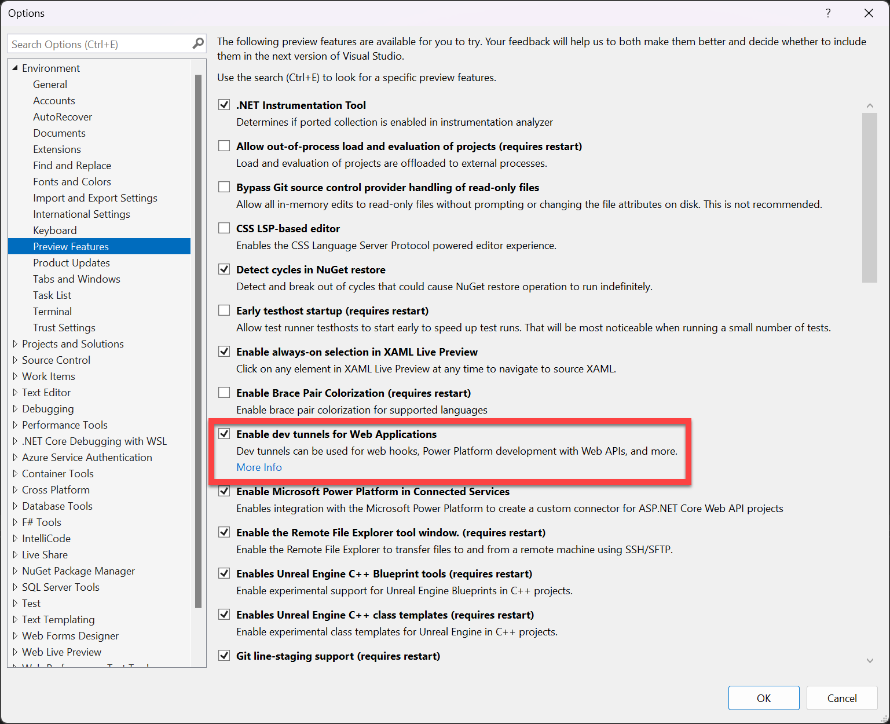
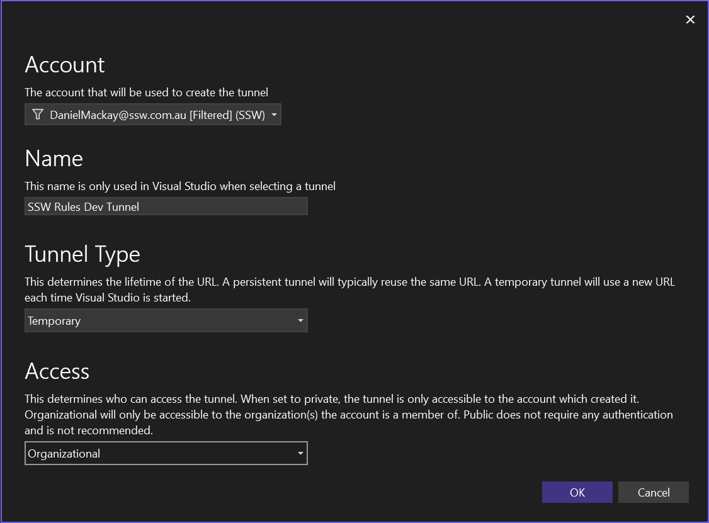
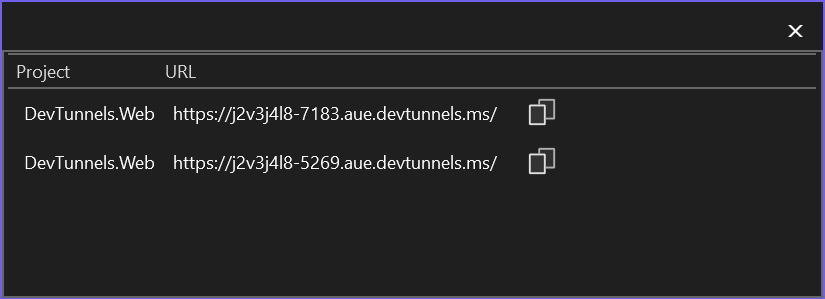
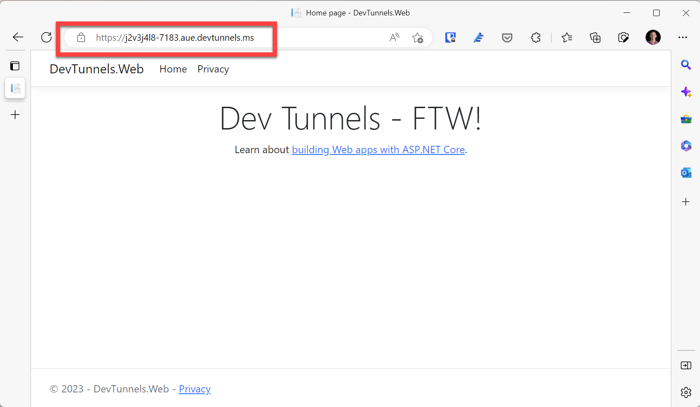
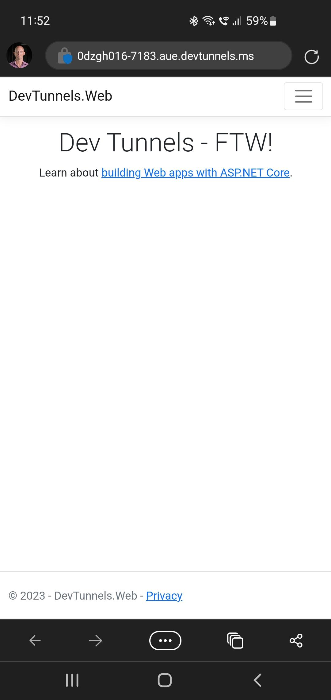

In the old days, you had to deploy your entire application to a staging environment just so you could share it with other members of your team. That process was a huge hassle and made it much harder to get feedback quickly. 

Luckily, port forwarding is the silver...errr...golden bullet that solves this issue. Port forwarding helps by exposing a locally running application over the internet for testing or other purposes. 

3rd party solutions have existed for awhile, but they need configuration and cost money. Now, Dev Tunnels is a new port forwarding feature in Visual Studio that can help developers do that for free.

<!--endintro-->

`youtube: https://www.youtube.com/embed/4Fvq_g8skHE`
**Video: Simplify Remote Testing with Dev Tunnels | [Daniel Mackay](https://ssw.com.au/people/daniel-mackay/) | SSW Rules (7 min)**

## Use Cases

* Feedback on a locally running application
* Testing of an application on a mobile phone or tablet
* Webhooks: public service needing to make an API call to your local website (e.g. Twilio or Sendgrid webhook)
* Azure SignalR: Get the Azure hosted signal R service to send websocket messages to your local website
* Azure APIM: Use APIM as a gateway that points to a locally running API
* Power Platform: Debug Power Platform by running your API locally
* Locally testing applications which need to communicate on a port blocked from your environment (i.e. using a [Jump Server](https://en.wikipedia.org/wiki/Jump_server))

## Options

* [Dev Tunnels](https://learn.microsoft.com/en-us/aspnet/core/test/dev-tunnels?view=aspnetcore-7.0) (Recommended)
* [ngrok](https://ngrok.com)
* [TunnelTo](https://tunnelto.dev)
* [Packet Riot](https://packetriot.com)
* [SSH port forwarding](https://linuxize.com/post/how-to-setup-ssh-tunneling/)

## Dev Tunnels Setup

::: info
Dev Tunnels is currently only available via Visual Studio 2022 17.5+
:::

### Pre-Requisites

* Visual Studio 2022 17.5+
* ASP.NET Core project

### Usage

1. Enable the Dev Tunnels via **Tools | Options | Environment | Preview Features**:

   
2. Open the Dev Tunnels window via **View | Other Windows | Dev Tunnels**
3. Create and configure a new Dev Tunnel:

   
4. Run the website
5. Get the public URL via **Dev Tunnels | Tunnel URL**:

   
6. Confirm you can browse your site via the public URL:

   
7. Confirm you can browse via a mobile:

   ::: img-medium
   
   :::

## Best Practices on Access Types

* **Private:** Ideal if you are testing yourself on mobile device
* **Organization (Recommended):** Ideal if you need feedback from others within the organization
* **Public:** For when the other two options are not possible (e.g. Web hooks). In this case it is recommend to use Temporary tunnels so that the URL is no longer available once you've closed visual studio

## Resources

* [MS Learn - Port Tunneling](https://learn.microsoft.com/en-us/connectors/custom-connectors/port-tunneling)
* [How To - Dev Tunnels](https://learn.microsoft.com/en-us/aspnet/core/test/dev-tunnels?view=aspnetcore-7.0)
* [Dev Tunnels Public Preview](https://devblogs.microsoft.com/visualstudio/public-preview-of-dev-tunnels-in-visual-studio-for-asp-net-core-projects)
* [Twilio Webhooks](https://www.twilio.com/blog/use-visual-studio-port-tunneling-with-twilio-webhooks)
