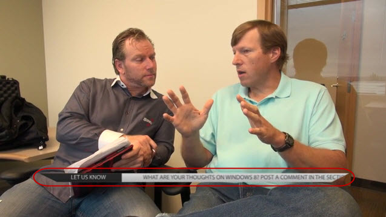

For argument's sake, it makes sense to refer to any text pop-up on screen as a 'caption'. It is helpful to the viewers to include still or animated captions (also known as lower thirds) in your videos because they enhance or add extra information that is not fully explained by the speakers. A sub-category of captions is *titles**,*which is the term given to identifying text, such as the opening film credits, someone's name and job title or "1985 - New York City".

<!--endintro-->
<dl class="badImage">&lt;dt&gt;
      
   &lt;/dt&gt;<dd>Figure: Bad example of captions - Text is too small and hard to read.</dd></dl><dl class="goodImage">&lt;dt&gt;
      
   &lt;/dt&gt;<dd>Figure: Good example of Captions - Text is clear and legible. Provides extra value to the viewer with content not mentioned in the video</dd></dl>
Now you cant really have just one type of caption. Have defined styles for different types of videos

eg. Here are the styles SSW use for their videos:
<dl class="goodImage">&lt;dt&gt;
   &lt;/dt&gt;<dd>Figure: Example 1: SSW Infomercials - Clear, nice effects and well stylized.</dd></dl><dl class="goodImage">&lt;dt&gt;
      
   &lt;/dt&gt;<dd>Figure: Example 2: General SSW TV videos - corporate branding, clear, eye catching</dd></dl><dl class="goodImage">&lt;dt&gt;
      
   &lt;/dt&gt;<dd>Figure: Example 3: SSW Rules Videos - this is a good generic title style and works well for documentary style videos</dd></dl><dl class="goodImage">&lt;dt&gt;
      
   &lt;/dt&gt;<dd>Figure: Example 4: SSW Case Studies - This allows us to represent Scrum roles with an icon</dd></dl>
Remember to put any links that you've mentioned in the captions underneath your video in it's own section (with a heading such as 'Show Notes' or 'Related Content'). You can also use this section to put in links that are related to what was said in the video as evidence (similar to footnotes or a bibliography in a book). That way, you will gain more Google juice and it will make it easier for the Product Owner to review your captions.
