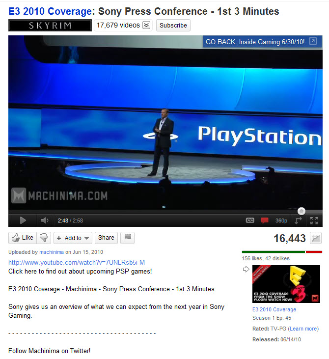

For most users, YouTube only allows a maximum length of 15 minutes on their videos. As such, if you have videos that are longer than 15 minutes, they will need to be uploaded to a video site that does allow longer video uploads, such as Wistia or Vimeo. The problem with doing this is that you aren’t harnessing the 2nd biggest search engine in the world to promote your content and without that, your video campaign isn’t reaching its full potential. The best way to solve this problem is to follow these steps:

<!--endintro-->

1. Create either a 'highlights' version, split the video into parts or create 'the first [between 3 and 15] minutes' version of all your longer videos, especially the popular ones.
2. At the end of these clips include a [call to action](/Pages/Adding-a-call-to-action.aspx)that prompts the viewer to see the full version at your other site(s). If your other site(s) offer free viewings, make sure you mention this.
3. Upload these versions to YouTube (preferably around the same time you upload the full versions to other sites).

 
 **Figure: Bad Example – No call to action prompting viewers to go and see the full version.**  
 
Figure: Okay Example – A link to the full version is included in the description section but no Call to Action in the actual video.

 Figure: Good Example - contains a clear, live action call to action directing the viewer to see the full version.
