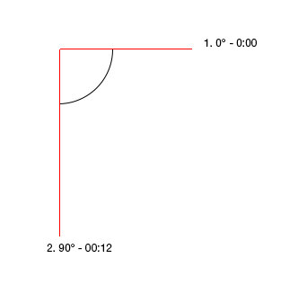

The text swing in can be a great way to make a title gain attention, but if the angles are wrong, the unnatural nature of it will be jarring. The idea is to simulate gravity. The best tool to create this type of effect is Adobe After Effects.

* Each keyframe should be half the angle of the previous keyframe from 90 degrees
* Each keyframe should be half the distance on the timeline from the previous keyframe

<!--endintro-->
<dl class="image">&lt;dt&gt; &lt;/dt&gt;&lt;dt&gt;Figure: Bad Example - this does not simulate gravity and will be jarring to the viewer&lt;/dt&gt;&lt;dt&gt; &lt;/dt&gt;&lt;dt&gt; &lt;/dt&gt;<dd>Figure: Good Example - Angle/time graphic for "Swing In" effect</dd></dl><dl class="goodImage">&lt;dt&gt; 
      
   &lt;/dt&gt;
   <dd>Figure: Good example – A well designed 'swing-in' effect can bring your titles to life - See 0:07 in this 
      <a href="http://youtu.be/0ugMkda9IBw?t=7s">video example</a></dd></dl>
