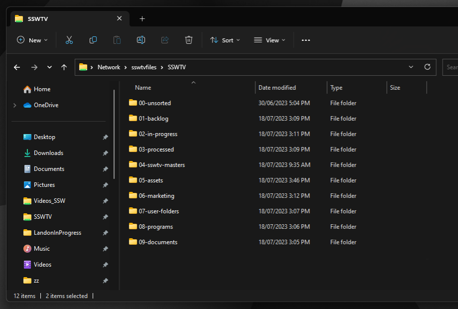

Figuring out how your workflow operates is an essential part of the editing process. As such you should make sure to have an effective and consistent file/folder structure.

<!--endintro-->

### Video Project Organization

Things that go under each main folder:

* **YYYY-MM-DD-project-name**

  * Assets

    * Contains all external files, and a copy of any files used from the server's 05-assets directory
  * Edit

    * Contains the active project files, e.g. Premire Pro .pproj files
  * Exports

    * Contains all edit exports & renders
  * Footage

    * Contains all captured media, e.g. video, screen captures, & audio that was recorded for the project

      * Use **YYYY-MM-DD-description**
      * Contains multi-day or multi-camera shoots
    * Graphics
    * Contains After Effect project files, e.g. .aep files

### Data Server Organization

It is also very important to keep your shared resources and servers organized.

Things that go under each folder:

* **00-unsorted**

  * Contains legacy folders that need to be sorted and put in an appropriate location.
* **01-backlog**

  * Contains all backlog video items to be processed.
  * The internal folder structure is **YYYY-MM-DD-project-name**
* **02-in-progress**

  * Contains all backlog video items currently in progress.
  * Each user should have their own personal folder named **\[Firstname]InProgress**
  * Folders are moved to a user's InProgress folder from 01-backlog
* **03-processed**

  * Contains all video items that have been finished (archived).
  * The internal folder structure is **YYYY-MM-DD-project-name**
* **04-masters**

  * Contains final exports from videos that can be showcased – a copy of the video file only, to be sorted in folders by year.
  * The internal folder structure is **YYYY** | **YYYY-MM-DD-project-name**
* **05-assets**

  * Contains all the assets for video editing and graphics, including:

    * graphics
    * music
    * sound-effects
    * fonts
* **06-marketing**

  * Contains folders used by the marketing team, including the Photos folder
* **07-user-folders**

  * Contains user’s personal folders
* **08-programs**

  * Contains installation files for video production software, including:

    * drivers
    * plugins
* **09-documents**

  * Contains documents - to be synchronized to `VIDEO-Videos`
