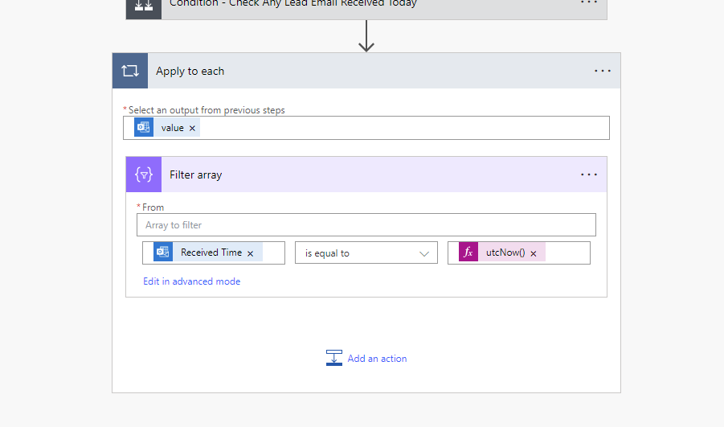

When working with Power Automate flows, there are instances where you need to use or compare the time in your flow, by default, it is set to UTC.

However, there are situations where using your local timezone might be more appropriate, especially for tasks or events that are specific to a particular region. It's important to choose the appropriate timezone based on the context and requirements of your task or system.

<!--endintro-->

::: bad

:::

- ❌ **Complex Time Zone Calculations**: Handling time zone conversions manually can become cumbersome, especially when dealing with events and meetings across multiple time zones
- ❌ **Daylight Saving Time Issues**: While UTC doesn't observe daylight saving time, your local timezone might. This can lead to confusion and scheduling problems when your local time changes
- ❌ **User Experience**: In user-facing applications, presenting times in UTC without local context can be confusing for end-users who expect times in their local time

So to convert it to the correct timezone, you can use built-in expression in your flow:

```js
convertTimeZone({{ array/object }}?[{{ 'timedate variable' }}], 'UTC', 'AUS Eastern Standard Time')
```

::: good

:::

For further details on converting timezones in Power Automate Flow, refer to the [Microsoft Learn - Converting time zone](https://learn.microsoft.com/en-us/troubleshoot/power-platform/power-automate/converting-time-zone-power-automate).
For default timezones, refer to the [Microsoft Learn - Default time zones](https://learn.microsoft.com/en-us/windows-hardware/manufacture/desktop/default-time-zones?view=windows-11).
