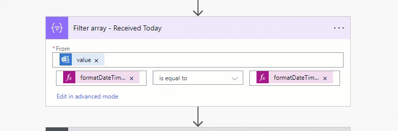

When working with Power Automate flows, there are instances where you need to use or compare the time in your flow, by default, it is set to UTC.

However, there is a chance that the wrong time zone is being used.

<!--endintro-->

Here is a bad example of comparing Datetime in PA Flows:

::: bad

:::

So to convert the timezone you can use built-in expression in your flow:

```json
convertTimeZone({{ array/object }}?[{{ 'timedate variable' }}], 'UTC', 'AUS Eastern Standard Time')
```

::: good

:::

For further details on converting timezones in Power Automate Flow, refer to the [Microsoft Learn - Converting time zone](https://learn.microsoft.com/en-us/troubleshoot/power-platform/power-automate/converting-time-zone-power-automate).
For default timezones, refer to the [Microsoft Learn - Default time zones](https://learn.microsoft.com/en-us/windows-hardware/manufacture/desktop/default-time-zones?view=windows-11).
