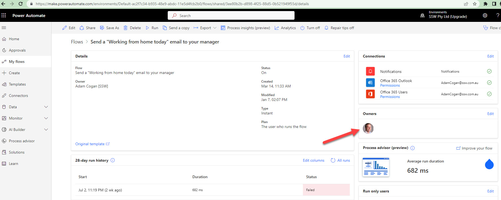

Using a service account is a common best practice. If a flow is not shared with a group, it will be lost when an owner leaves the company. 

<!--endintro-->

::: bad

:::

::: good

:::

### Do you have issues with connections in Power Automate flows?

If a Flow is exclusively shared with a single user, it will be deleted shortly after that user is deleted. We aim to avoid having any deleted flows.

For the above to not happen, share your flow with a group, so it is never deleted when the owner leaves the company or gets deleted. 

For e.g. Share with the SysAdmin group. Even when a connection string is lost or invalid, SysAdmins will get a notification to fix the problem
