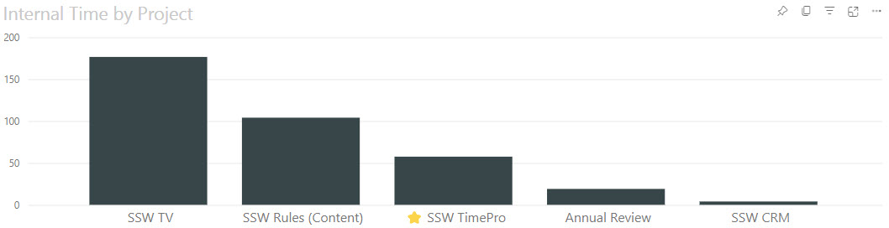

Power BI offers a variety of visualizations, each suited for different types of data and insights. Choosing the correct visualization is crucial for effectively communicating data stories.

Here's a guide to understanding when to use each type of visualization provided in Power BI, according to the visual selector interface.

<!--endintro-->

## Column Chart

## Stacked Column Chart

## Clustered Column Chart

## 100% Stacked Column Chart

## Bar Chart

## Stacked Bar Chart

## Clustered Bar Chart

## 100% Stacked Bar Chart

## Line Chart

## Line and Stacked Column Chart

## Ribbon Chart

## Area Chart

An Area Chart would be chosen over a Line Chart when you want to highlight the cumulative magnitude of values over time, showing not just the trend but also the volume beneath the trend line, emphasizing the total value across the timeline.

e.g. If you are looking at the total revenue generated by a product over the same period, an area chart is better than a line chart because it not only shows the trend of revenue over time but also gives a sense of the total revenue accumulation, providing a visual impression of growth beyond just the trend line.

<!--EndFragment-->

## Stacked Area Chart

Area charts are excellent for stacked charts because it’s a simple and clear way to clearly portray the cumulative nature of the data. For example, if the above example was visualized with a line chart, it wouldn’t be immediately apparent to the user that the values are added together, not compared against each other.

## Pie Chart

Choose a pie chart when you need a simple, classic representation of each category's contribution to the whole, where the focus is on relative sizes of the parts to the whole.

## Donut Chart

Opt for a donut chart over a pie chart when you want to include additional information in the center, such as the total value, or to improve readability when comparing multiple pie-like charts.

## Treemap

A treemap is preferable to a pie or donut chart when you have hierarchical data and need to show part-to-whole relationships across multiple levels in a compact and space-efficient manner.

## Map

## Filled Map

## Scatter Chart or Bubble Chart

For example, if you're trying to identify if there's a relationship between sales volume and advertising spend, a scatter chart can plot each point of data in the two-dimensional space where one axis represents sales volume and the other represents advertising spend. 

This visualization is beneficial when you want to explore potential connections or correlations between variables, identify outliers that don't fit the general pattern, or even to see the distribution and concentration of data points. 

If a 3rd dimension is added (as above) it's represented by the size of the bubbles. this sometimes known as a Bubble Chart.

## Waterfall Chart

The clear visualization of incremental changes helps identify how individual components contribute to the total outcome, making the waterfall chart a powerful tool for detailed, step-by-step analysis.

## Funnel Chart

## Gauge Chart

In this example, a car retailer is tracking the sales team's average sales per month. The gauge needle represents the sales goal of 140 cars sold. The minimum sales average is zero and the maximum is 200. The blue shading shows that the team is averaging about 120 sales this month. They have one more week to reach the goal.

## KPI (Key Performance Indicator)

This space efficient visualisation shows the target number, the current number, the variance %, and the trend of the number over time.

## Card

## Multi-Row Card

## Table

## Matrix

* **Use when:** Showing data structured in rows and columns, often with aggregates.

## Slicer

* **Use when:** Allowing users to filter and segment the data interactively.

## Single Row Card

* **Use when:** Displaying a single metric that stands out without additional context.

## Ellipsis (Other)

* **Use when:** Accessing additional visuals not shown directly on the visualization pane or custom visuals.

Remember, the choice of visualization should not only depend on what looks good but also on what communicates the data most effectively to your audience.

:::greybox 
**Tip:** Always preview your data with different visualizations to determine which one best tells the story of your data.
:::