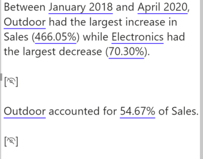

Power BI offers a variety of visualizations, each suited for different types of data and insights. Choosing the correct visualization is crucial for effectively communicating data stories.

Here's a guide to understanding when to use each type of visualization provided in Power BI, according to the visual selector interface.

<!--endintro-->

## Column Chart

## Stacked Column Chart

## Clustered Column Chart

## 100% Stacked Column Chart

## Bar Chart

## Stacked Bar Chart

## Clustered Bar Chart

## 100% Stacked Bar Chart

## Line Chart

## Line and Stacked Column Chart

## Ribbon Chart

## Area Chart

An Area Chart would be chosen over a Line Chart when you want to highlight the cumulative magnitude of values over time, showing not just the trend but also the volume beneath the trend line, emphasizing the total value across the timeline.

e.g. If you are looking at the total revenue generated by a product over the same period, an area chart is better than a line chart because it not only shows the trend of revenue over time but also gives a sense of the total revenue accumulation, providing a visual impression of growth beyond just the trend line.

<!--EndFragment-->

## Stacked Area Chart

Area charts are excellent for stacked charts because it’s a simple and clear way to clearly portray the cumulative nature of the data. For example, if the above example was visualized with a line chart, it wouldn’t be immediately apparent to the user that the values are added together, not compared against each other.

## Pie Chart

Choose a pie chart when you need a simple, classic representation of each category's contribution to the whole, where the focus is on relative sizes of the parts to the whole.

## Donut Chart

Opt for a donut chart over a pie chart when you want to include additional information in the center, such as the total value, or to improve readability when comparing multiple pie-like charts.

## Treemap

A treemap is preferable to a pie or donut chart when you have hierarchical data and need to show part-to-whole relationships across multiple levels in a compact and space-efficient manner.

## Map

## Filled Map

## Azure Map

This visualization is suitable when you need not only to plot data points on a map but also to leverage Azure's cloud-based location services for more in-depth geographic analysis, such as calculating routes, visualizing traffic conditions, or creating heatmaps based on the intensity of activity in different areas. It's a powerful tool for scenarios requiring a combination of mapping and intricate spatial operations.

## ArcGIS Maps

ArcGIS Maps in Power BI is suitable for scenarios that require more than basic mapping, such as thematic maps, heat maps, and demographic layers. This visual is particularly useful when geographical context and spatial analysis are key to understanding and presenting your data, such as in urban planning, environmental monitoring, or market analysis.

## Scatter Chart or Bubble Chart

For example, if you're trying to identify if there's a relationship between sales volume and advertising spend, a scatter chart can plot each point of data in the two-dimensional space where one axis represents sales volume and the other represents advertising spend. 

This visualization is beneficial when you want to explore potential connections or correlations between variables, identify outliers that don't fit the general pattern, or even to see the distribution and concentration of data points. 

If a 3rd dimension is added (as above) it's represented by the size of the bubbles. this sometimes known as a Bubble Chart.

## Waterfall Chart

The clear visualization of incremental changes helps identify how individual components contribute to the total outcome, making the waterfall chart a powerful tool for detailed, step-by-step analysis.

## Funnel Chart

## Gauge Chart

In this example, a car retailer is tracking the sales team's average sales per month. The gauge needle represents the sales goal of 140 cars sold. The minimum sales average is zero and the maximum is 200. The blue shading shows that the team is averaging about 120 sales this month. They have one more week to reach the goal.

## KPI (Key Performance Indicator)

This space efficient visualisation shows the target number, the current number, the variance %, and the trend of the number over time.

## Card

## Multi-Row Card

## Table

## Matrix

You might choose to use a matrix over a table in Power BI when you need to display data with two or more dimensions, allowing for a more complex hierarchical structure with expandable row and column headers, and when summarizing data with built-in aggregations, like sums or averages, is necessary for a condensed view.

## Slicer

## Key Influencers

The Key Influencers visualization helps in discovering patterns in the data, such as which variables most contribute to an increase or decrease in your target metric. It is particularly useful in scenarios where you want to perform a lightweight and interpretable form of analysis to drive business decisions, such as understanding customer satisfaction drivers or pinpointing reasons for sales trends.

## Decomposition Tree

The decomposition tree is effective for drilling into dimensions of data to see how they contribute to the overall metric, allowing for dynamic exploration by users who can choose the factors to analyze at each level of the tree. It is particularly useful for ad-hoc exploratory analysis and root cause determination.

## Q&A

The Q&A visual is particularly useful when users may not be familiar with the underlying data model or when they wish to explore the data without pre-defined reports or dashboards. It's a powerful feature for creating a conversational data exploration experience within Power BI.

## Smart Narrative

Smart Narrative is ideal for creating data-driven narratives that provide context, explanations, and annotations, enhancing the report's storytelling aspect. This feature is particularly useful when you want to provide written explanations alongside your data or to offer automated interpretations of complex visualizations for report viewers.

## Metrics

The Metrics visual can combine numbers, charts, and conditional formatting to provide a comprehensive snapshot of performance, making it ideal for dashboards that executives and team leaders use for quick status checks and decision-making.

## Paginated Reports

Paginated Reports are ideal for creating highly formatted, multi-page documents that can be exported to formats like PDF and Word, often used for regulatory filings, invoice generation, detailed financial statements, or any scenario where the layout and format are as important as the data itself.

## Power App

The Power Apps visual allows you to bring the capabilities of custom apps into your dashboard, enabling users to perform tasks or input data directly from the report. This is particularly useful for creating a seamless workflow where users can act on data insights without leaving the Power BI environment, such as updating records or triggering business processes.

## Power Automate

The Power Automate visual allows you to set up automated workflows that can be triggered directly from your reports. This is ideal for scenarios where immediate action is required based on data changes or thresholds, like sending alerts, integrating with other services, or initiating business processes in response to data-driven events.

## Ellipsis (Other)

* **Use when:** Accessing additional visuals not shown directly on the visualization pane or custom visuals.

Remember, the choice of visualization should not only depend on what looks good but also on what communicates the data most effectively to your audience.

:::greybox 
**Tip:** Always preview your data with different visualizations to determine which one best tells the story of your data.
:::