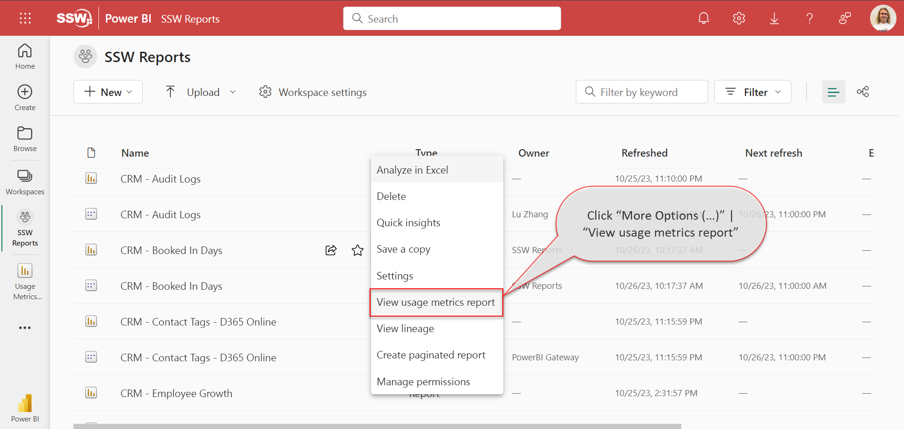
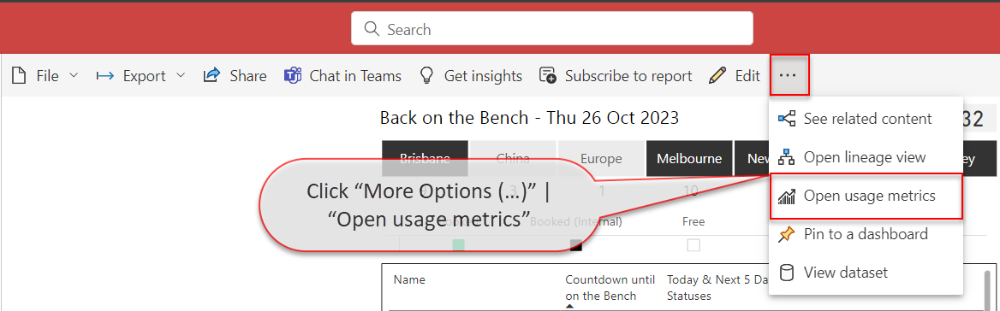

Monitoring Power BI report usage provides the organization with a valuable insight into the effectiveness of their reporting strategies. By tracking how reports are being accessed and engaged with, businesses can make data-driven decisions to optimize their content, allocate resources efficiently, and enhance the user experience. 

This information is essential for understanding which reports are delivering the most value, enabling organizations to prioritize their efforts, improve content relevance, address performance bottlenecks, and align their resources with actual demand. Moreover, monitoring report usage supports security and compliance efforts by detecting unauthorized access patterns, ensuring data protection.

<!--endintro-->

## Access Usage Metrics Report

You need one of the below [permissions in the Power BI Workspace](https://learn.microsoft.com/en-us/power-bi/collaborate-share/service-roles-new-workspaces) to access [Usage Metrics Report](https://learn.microsoft.com/en-us/power-bi/collaborate-share/service-modern-usage-metrics):
-	Admin
-	Contributor
-	Member 

You have 2 options to view the Usage Metrics Report for an individual report:

- Inside your Workspace for the Report, that you are interested in, click “More Options (…)” | “View usage metrics report”.
  

- Inside opened Report in the command bar click “More Options (…)” | “Open usage metrics”.
  

If you're viewing a Usage Metrics report for the first time, Power BI may initially open the old version of the this report. To access the enhanced Usage Metrics report, toggle the "New usage report" switch located in the command bar.

Usage Metrics Report dataset contains data for the last 30 days and refreshes daily.

The report contains 4 pages:
- **Report usage** – Shows such information as number of report open requests and views per user or per page
- **Report performance** – Shows trends of Open Report actions
- **Report list** – Shows the list of all reports in the workspace and their metrics
- **FAQ** – Shows the answers to frequently asked questions about Usage Metrics Report

## Customize Usage Metrics Report

While Usage Metrics Report already provides valuable information, it can be potentially further enhanced.

If you want, for example exclude certain users or reports from these metrics, it can be achieved modifying this report.

If your workspace does not already contain a customised Power BI Report Usage report, you must first save a copy of your Usage Metrics Report by clicking File | Save a copy. You will then need to input the name for a new report and select the workspace where you want to save it.

The new Power BI Report Usage report will be visible to the users with the Viewer role, unlike the default Usage Metrics Report.

The report will have Edit button available in the command bar. It allows you to go into the Editing view, as with any regular report, and change filters, add new pages and more.
