Creating Power BI Template Apps is an efficient way to manage and distribute Power BI reports and dashboards with other external users.
Once the Template App is created it will live in the [Power BI Apps](https://app.powerbi.com/groups/me/getapps/apps) marketplace. 
Users have the ability to use the template app with their own data or use the default data provided.

<!--endintro-->

### Create Power BI Template Apps

#### Prerequisite
* Must have a Power BI Pro license
* Have a sample database with dummy data as the default connection for the template app (See section on "Configure a Database for Template Apps" for more information) 

#### Steps

1. **Enable "Develop Template Apps" in the Workspace**  
Enabling "Develop Template Apps" in your Workspace allows you to create apps within the workspace. 
In the workspace you can then choose which of your reports goes into an app, and you can share the app with other people without exposing the entire workspace.
To enable Template Apps you can either enable the current workspace or create a new workspace.
    - **Option A: Upgrade Current Workspace**
      1. Navigate to your Power BI workspace settings.
      2. Ensure the "Develop Template Apps" option is enabled.
      
         ::: greybox
         **Note:** The workspace might need to be upgraded, if so request an admin to upgrade the workspace
         :::
      
      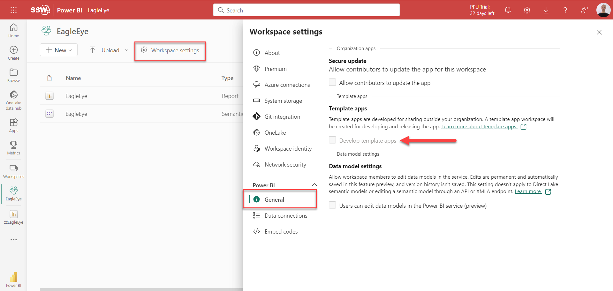 

   - **Option B: Create a New Workspace**
     1. Create a new workspace 
     2. Go to "Advanced", and under the "Template Apps" tick off "Develop Template Apps".
     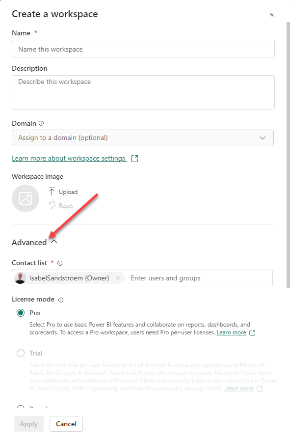 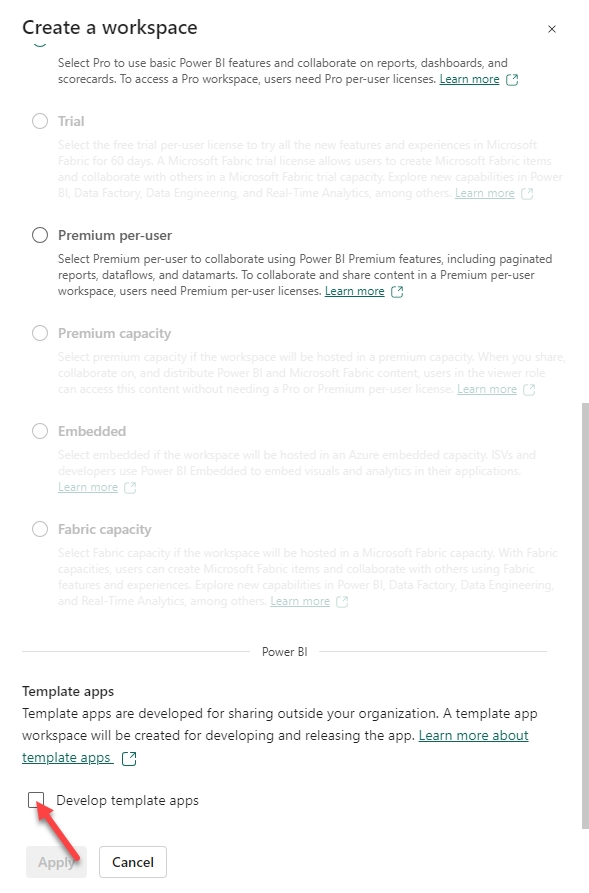
   
   ::: greybox
   **Note:** Once enabled, this setting cannot be reversed. [Learn More](https://community.fabric.microsoft.com/t5/Service/Workspace-develop-a-template-app-option-is-greyed-out/m-p/2319432)
   :::

2. **Add Reports in Workspace**  
Add reports in your workspace as you normally would by creating or uploading reports 

3. **Create and Configure the App**
   1. Within the workspace, create your app by clicking "Create App"
   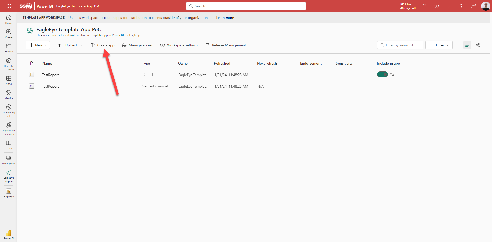
   2. This will open up a form, fill out all the fields
   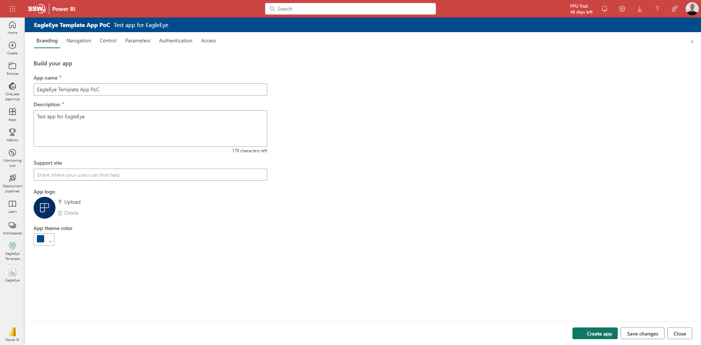
   3. In the Navigation pane, select the reports to be included in the app
   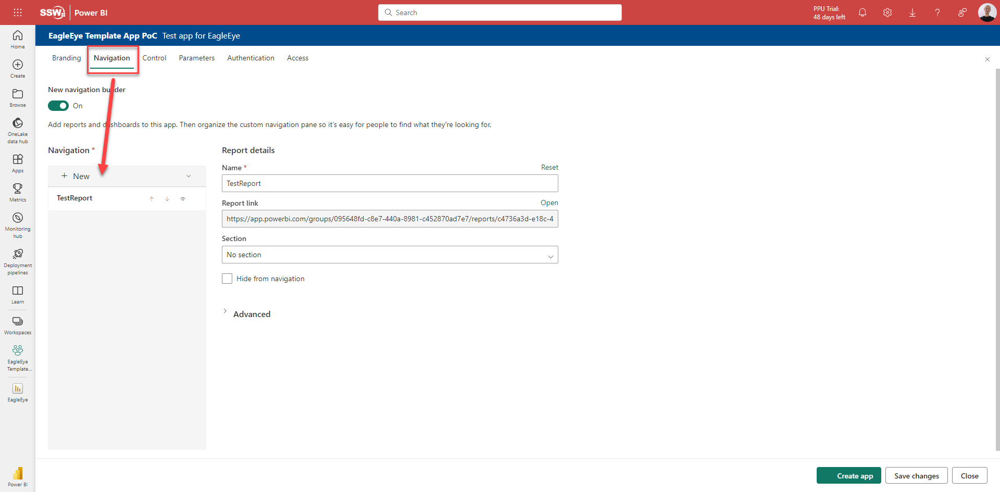
   4. Once everything is filled out, click the "Create app" button
   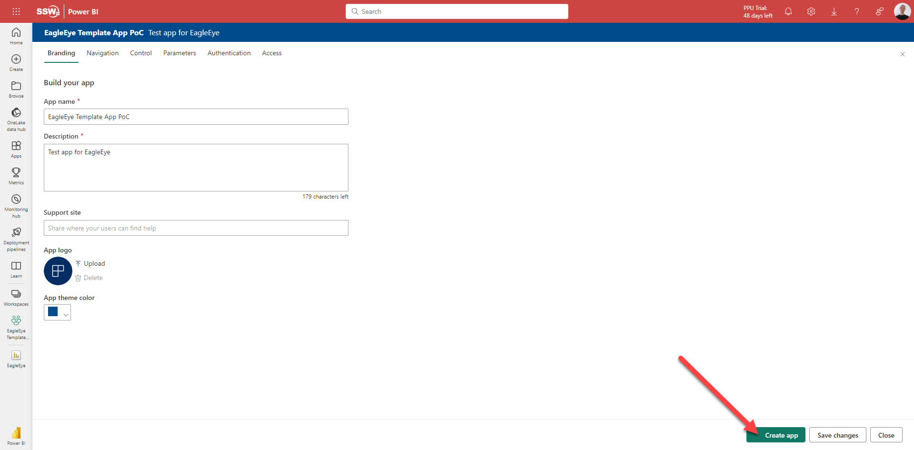

4. **Manage the App**  
Manage your app in the "Release Management" pane. Here you can 
   - Update the app once you have new changes in the report by clicking "Create App"
   - Share the app to specific people to test it out by clicking "Get Link"  
   ::: greybox Note that users need to be granted access before they can use the link. This can be done in "Manage Access" :::
   - Publish the app by clicking "Promote app"
   

::: greybox
**Note:** The reports in the app will be readonly.
:::

### Configure a Database for Template Apps

#### Set Up Database Parameters in Power BI

1. In Power BI go to "Home" | "Transform Data". This will open up a new window.
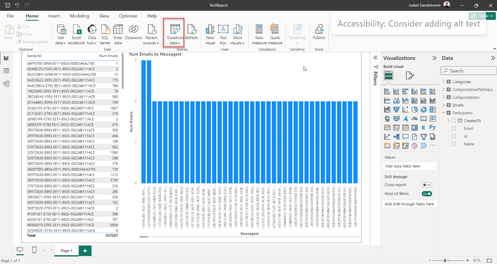
2. Add a new parameter by going to "Home" | "Manage Parameters" | "New Parameters"
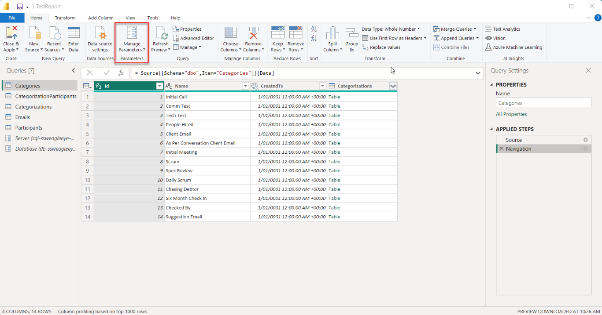
3. Fill out the pop-up box for a new parameter and press "OK".   
E.g. for a database you might need a parameter for Server and a parameter for Database
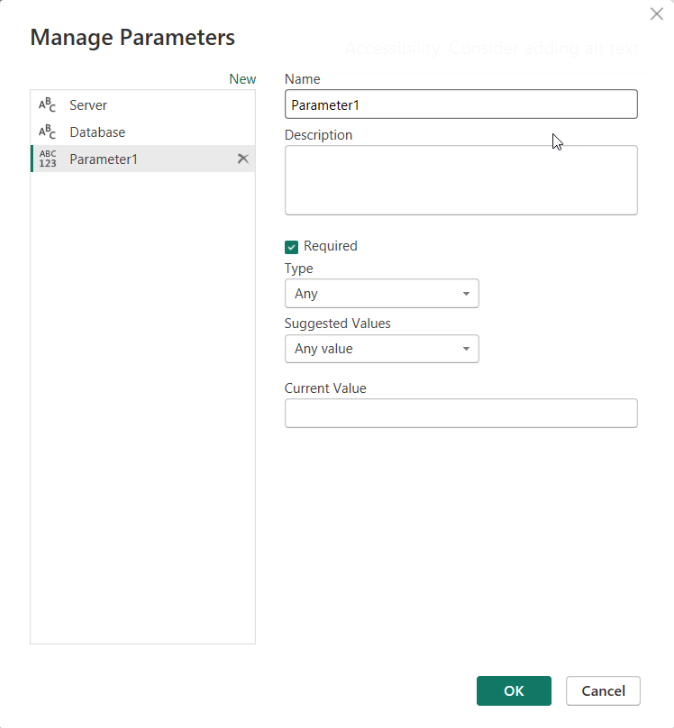
4. Back in the Transform Data window you have two new parameters. You can see them in the left pane (See #1 in image below).
5. To edit the source to use the parameters click on the "Applied Steps" | "Source" in the right pane(#2), and edit the source in the function field(#3).
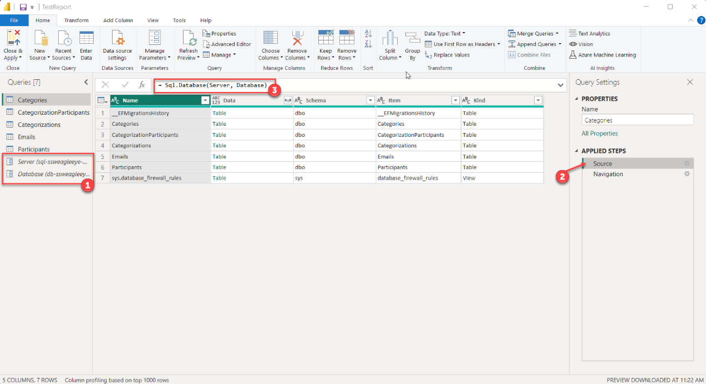
6. When creating the app, set the parameters default value in the "Parameters" pane and tick them off as "Required". The default values should go to the dummy database.
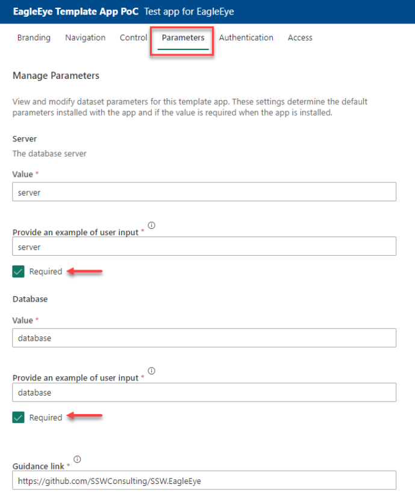

#### User Setup for Installed Apps

When users install and open the app they can browse the app with the dummy data from the default connection. 
The user will have the option to connect their data by following the following steps:

1. Select "Connect your data" in the message at the top of the page
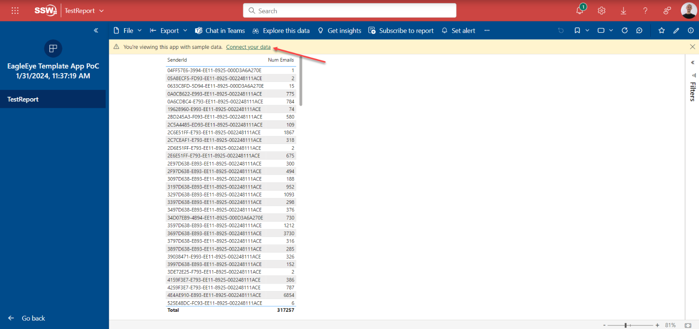
2. Enter details for the "Server" and "Database" parameters in the pop-up
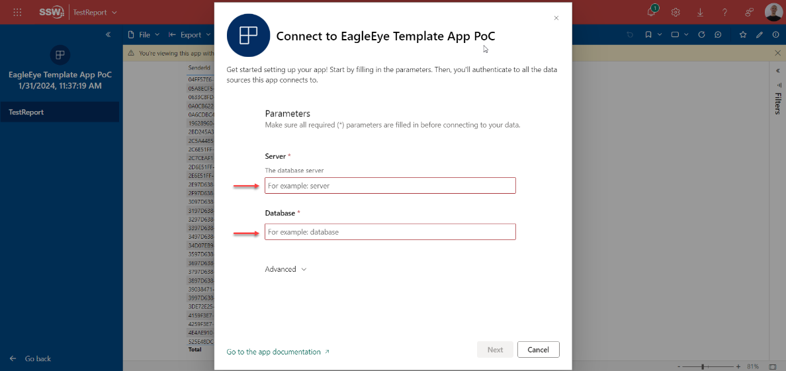
3. Authenticate to the database
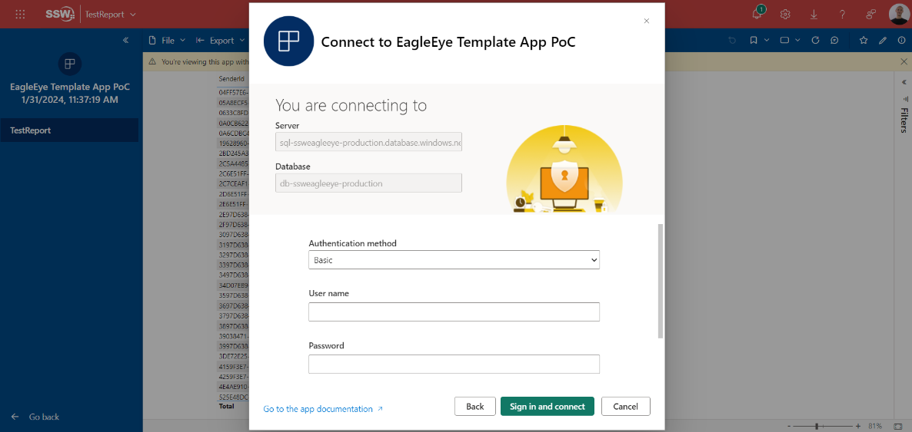
4. Once authenticated, users can start exploring the app with their own data 🚀

### Pros
- **Ease of Distribution:** Template apps provide an easy way to distribute Power BI content to external users. Once published to the Power BI service, these apps can be shared widely without needing to individually manage access permissions.
- **Ease of Maintainance:** Template apps simplify the process of updating and maintaining the Power BI content with their Release Management.
- **Data Source Flexibility:** Users can easily integrate their own data.
- **Trial with Sample Data:** Testing the app with sample data allows users to easily explore and understand features before using their own data. As an added bonus this is also great for demos.

### Cons
- **Dependency on Power BI Environment:** External users need to have access to Power BI (either Pro or Premium license), which may limit the accessibility for some users. To create Template Apps a Power BI Pro license is necessary.
- **Initial Setup Complexity:** Setting up a template app for external sharing require more overhead to set it up.
- **Limited Customization for End Users:** While creators can customize the app, end users have limited ability to modify or interact with the content beyond basic filtering and slicing.
- **Performance Considerations:** Large datasets or complex visualizations may impact the performance and loading times for end users.

### Learn more
- [What are Power BI template apps?](https://learn.microsoft.com/en-us/power-bi/connect-data/service-template-apps-overview)
- [Create a template app in Power BI](https://learn.microsoft.com/en-us/power-bi/connect-data/service-template-apps-create)
