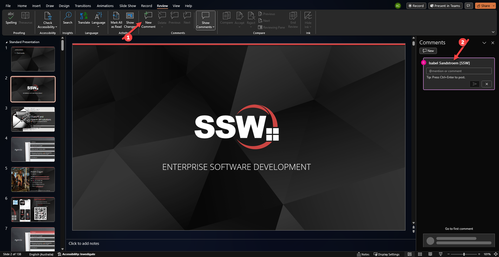
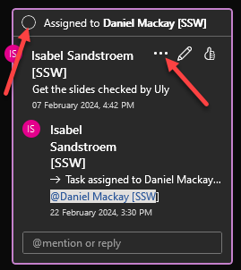
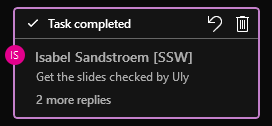

Imagine you've just finished a draft of your PowerPoint presentation and you send it off to your colleagues for feedback. You receive it back with a mix of emails, separate documents, and verbal comments - a nightmare to consolidate and action.

<!--endintro-->

### The Power of PowerPoint Comments

This is where PowerPoint comments come into play, providing an effective workflow for gathering and acting on feedback.
PowerPoint comments allow you to add notes directly on the slides, offering a simple and integrated way to give and receive feedback. This method keeps all the feedback in one place, making it easier to review and act upon.

#### How to Use Comments Effectively

1. **Adding Comments:** Go to the specific slide you want to add a comment. Go to 'Review' tab | 'New Comment' or right-click on the slide and select 'New Comment'. In 'Comments' pane on the right hand side , type your feedback or suggestion directly into the comment box.

2. **Replying to Comments:** If you're responding to feedback, use the 'Reply' feature within the comment to maintain a threaded conversation. This keeps the discussion organized and easy to follow.

3. **Convert Comments to Tasks:** When reviewing comments, identify action items and assign them to team members by tagging them in the reply and ticking off the 'Assign to:' box.

4. **Resolving Comments:** Once you've addressed a comment or task, mark it as 'Resolved' by either ticking off the circle in the top left corner or clicking the three elipses | 'Resolve task'. This helps in tracking which feedback has been actioned and keeps the slide uncluttered.

5. **Reviewing Comments:** Regularly review comments to ensure that all feedback is addressed. It's easy to overlook comments, so make a habit of checking them.

### Conclusion

Using PowerPoint comments for feedback and task assignment offers a cohesive, efficient, and trackable way to improve your presentations. It streamlines the feedback process, reduces miscommunication, and ensures that everyone on the team is on the same page.