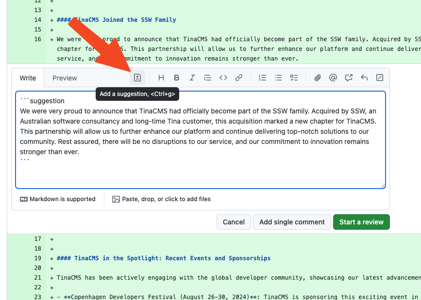
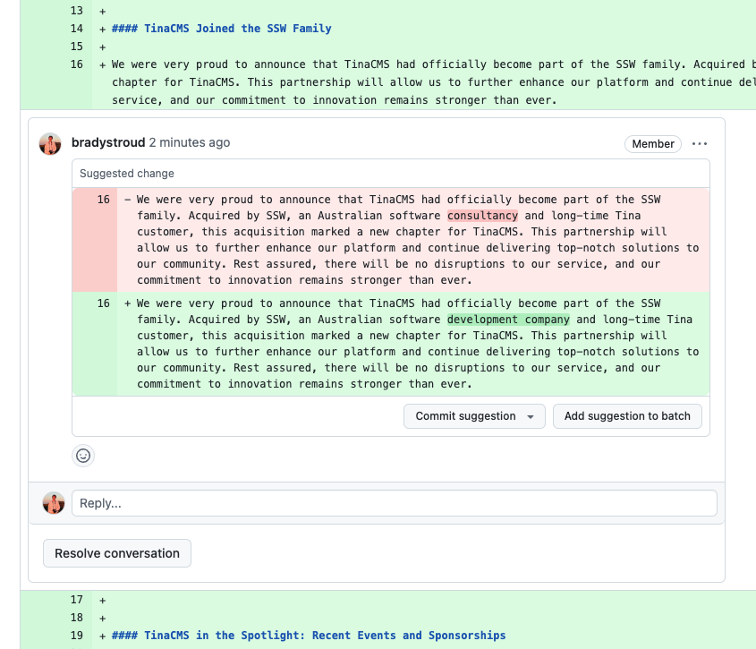

Normally, the best way to provide feedback on content changes is to use the [change X to Y format](/change-from-x-to-y).
When it comes to reviewing Pull Requests (PRs) in GitHub, this is not the case - its  inefficient for the PR owner. They have to manually interpret each suggested change, implement them in the code, and then commit the changes, which can be time-consuming.

<!-- `youtube: TODO`
**Video: TODO** -->

::: bad

:::

Instead, reviewers should use GitHub's **Add a suggestion** feature. This allows the reviewer to directly suggest changes in the code diff view, and the PR creator can easily accept or reject these changes with a single click. This process is more streamlined and makes it easier to implement suggestions.

::: good

:::

<!--endintro-->

When the PR creator reviews the suggestion, they can either click **'Commit suggestion'** to apply it directly or **'Resolve conversation'** if they choose not to apply it.

::: good

:::
