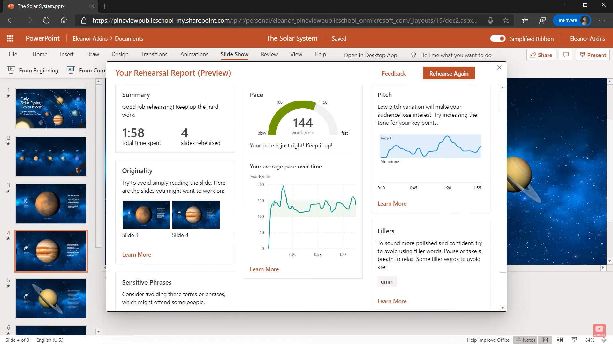

So you have a shiny PowerPoint deck with heaps of great content, and you know what you want to say! Are you ready to present? No, not yet.

You need to practice it so that you know your stuff backwards as well as forwards.

`youtube: https://youtu.be/jPwNwNdE7pE`

::: good
**Figure: Good example - you need to practice your content forwards and backwards to be as good as Victor Borge.**
:::

These 4 steps can improve the delivery of a speech immensely. [Inspired by [Vinh Giang](https://www.vinhgiang.com/)):

<!--endintro-->

1. Record the test please.
2. Do an audio audit – play the recording, only listen to the audio (don’t look at the video).

   👀 Check: are you speaking too fast/too slow?, are you pausing appropriately? Voice stressing/pausing on important points? Are you too loud/too soft?

   ::: info
   Tip: PowerPoint’s "Rehearse with coach" will give you immediate feedback when practicing.
   :::

3. Do a visual audit – play the recording, this time looking at the video only (turn down the volume to zero, so that you can’t hear the audio).

   👀 Check: How is your body language?, movement of your hands less/more? (more hand movement means more distraction) Eye contact? Posture? Are you smiling or do you look stunned?

4. Use a transcript generator and get your speech printed on paper. (Include all the words)

   👀 Check: Cut off the unwanted words that does not add meaning, identify how many times you use "umms" , "you know", and repetitive words that we all have a habit of using.

   ::: info
   Tip: PowerPoint’s "Rehearse with coach" will give you track these types of unwanted words.
   :::

5. Practise to reduce the repetitions and non-value adding words.

