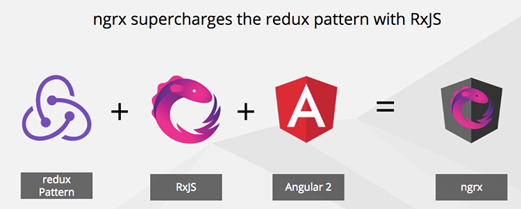

      <b>​Heads Up​:</b> For new teams creating their first SPA using Angular, it is recommend to limit the initial focus to learning Angular, TypeScript, and RxJs. Avoid including advanced state management patterns such as NgRx, unless someone on the team has prior experience. Start with a simple approach to state management and evolve your design once the team has mastered the basics. When your team is ready, be sure to investigate the multitude of patterns, supporting libraries, and best practices available for advanced state management. If you are developing an application that absolutely requires advanced state management then be sure to invest in some training and / or enlist the help of another developer with the right skillset.

    ​​State management is complex and time-consuming.

On large applications, it becomes very difficult to maintain state. The redux pattern helps resolve this issue. ​​  
   
NgRx is the redux pattern implemented for Angular. 
      <a href="https://github.com/ngrx" target="_blank">View on GitHub</a>. 
       

 <excerpt class='endintro'></excerpt> 
<dl class="image"><dt>  </dt><dd>Figure: NgRx supercharges the redux pattern with RxJS  </dd><dd></dd></dl>
Benefits:
<ul><li>Easy state management</li><li>Better tooling and debugging</li><li>Simpler applications to build</li><li>Increased performance </li><li>Code that is easy to test </li></ul><dl class="image"><dt>  </dt><dd>Figure: NgR​x supercharges the redux pattern with RxJS  </dd></dl><dl class="image"><dt></dt><dd>Figure: The redux pattern is a way to implement a predictable state container</dd></dl>
The three principles of the redux pattern:
<ol><li>The entire state of the application is represented in a single JavaScript object called a store.</li><li>The store is acted upon using special functions called reducers. </li><li>State is immutable and reducers are the only part of the application that can change state.</li></ol>
​ 

