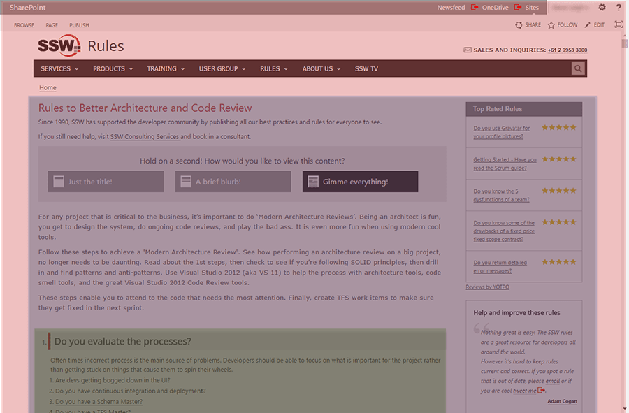

The Single Responsibility Principle is a well understood, and well-accepted tenant of good code design.  It states that a class should do one thing, and do it well – and an Angular component is no exception.

When designing components, keep them small, modular and reusable. For example, if you have a menu, put it into a menu component, don’t put it in your app component. 

 <excerpt class='endintro'></excerpt> 
<dl class="badImage"><dt></dt><dd>Figure: Bad example - Having just 3 components for the page makes it difficult to reuse, maintain and test​ </dd></dl><dl class="goodImage"><dt></dt><dd>Figure: Good example - Splitting up the page into 11 components means they are small and targeted - and thus easy to maintain and test. Components can be reused on other pages</dd></dl>​

