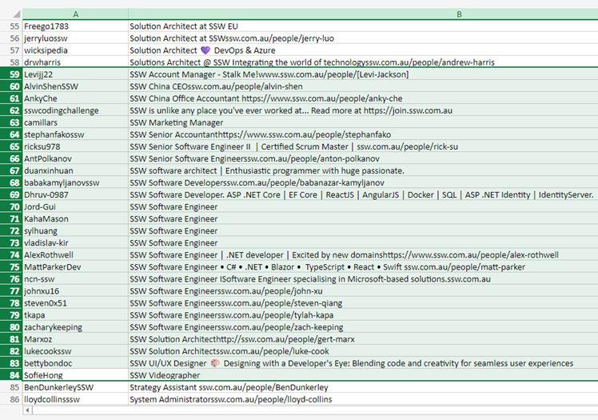

Consistency is the most important part of branding. It leads to familiarity which builds brand recognition. A simple and effective method is prefixing job titles everywhere they appear with the company name.

<!--endintro-->

::: info
**Note:** This applies to all platforms, including **LinkedIn**, **GitHub**, **X (Twitter)**, and others..
:::

A job title on social media or other public place should **always** be:

* **{{ COMPANY NAME }} {{ POSITION }}**
  E.g. "SSW Software Engineer"

::: info
On LinkedIn you might put your title in 2 places (bio and job experience) **In both places, you should use the correct format!**
:::

This is to maintain consistency across the company - the companies with strong branding have [consistency](https://blog.hubspot.com/blog/tabid/6307/bid/34231/8-businesses-that-nail-social-media-brand-consistency.aspx)!

::: bad img-medium

:::

::: good img-medium

:::

::: info
**Note:** Check out a cool way to use ChatGPT to extract profile info from all the users in your organization: <https://x.com/sethhdaily/status/1747460874544324917?s=20>

Following the above tweet, you can get a result like this:

::: good img-medium

:::

:::
