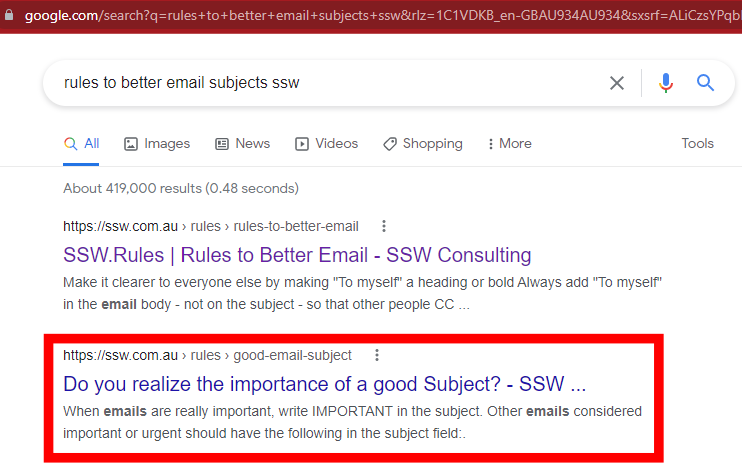
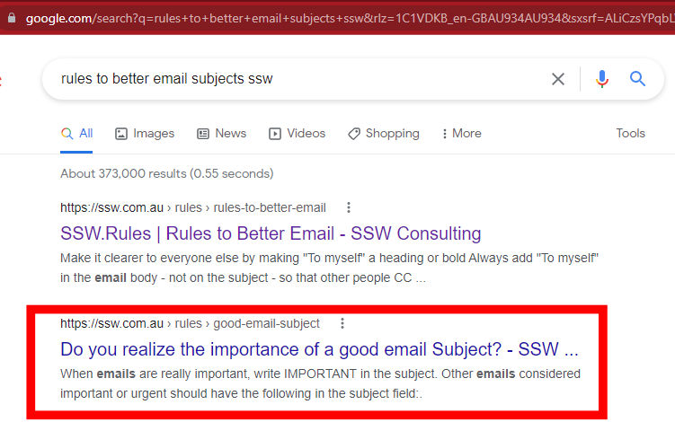
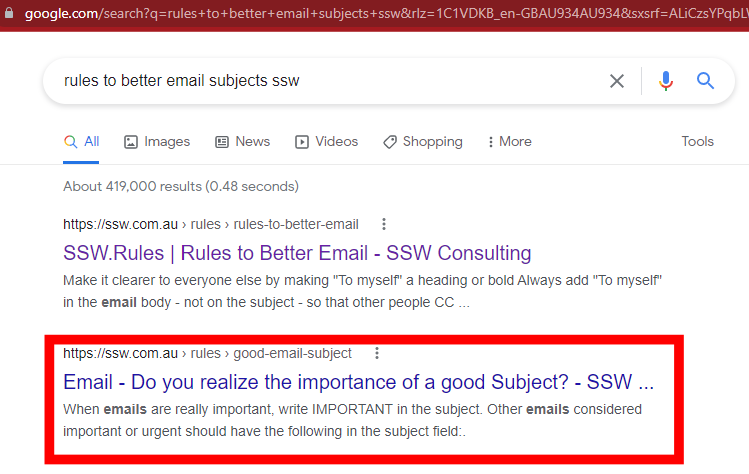

The English language is really complex, and often during a discussion you don't know the context until you get midway through the sentence, or even the end of the sentence. This problem is particularly notable when you are browsing a page on Google, because you lack the context of the rest of the page.

For example, a page might have a category on a website, but when you look at it in Google results, that category may not be shown.

Incorporating a prefix into webpage titles enhances clarity and immediately provides valuable context for users.

<!--endintro-->

At a bare minimum, the context should be completely fleshed out in the title of a page. However, the gold standard is to use prefixes.

Prefixes provide several benefits including:

* **Skimming** - Establishing context without having to read the full content
* **Contextualizing** - Priming the reader on the subject matter
* **Finding** - Helping the reader quickly jump to the right content in a list
* **Grouping** - Categorizing content together without the need for a complex bespoke solution

::: bad

:::

::: ok

:::

::: good

:::
