Why do we use it? 
The TV Team are consistently creating YouTube Chapter Links for videos such as the User Groups, Tech News Videos etc. In the past, this has been a manual and tedious process. However, this is no longer the case!  

We have developed a fast and easy method to export Premiere Pro Markers as YouTube Chapter Links.

<!--endintro-->

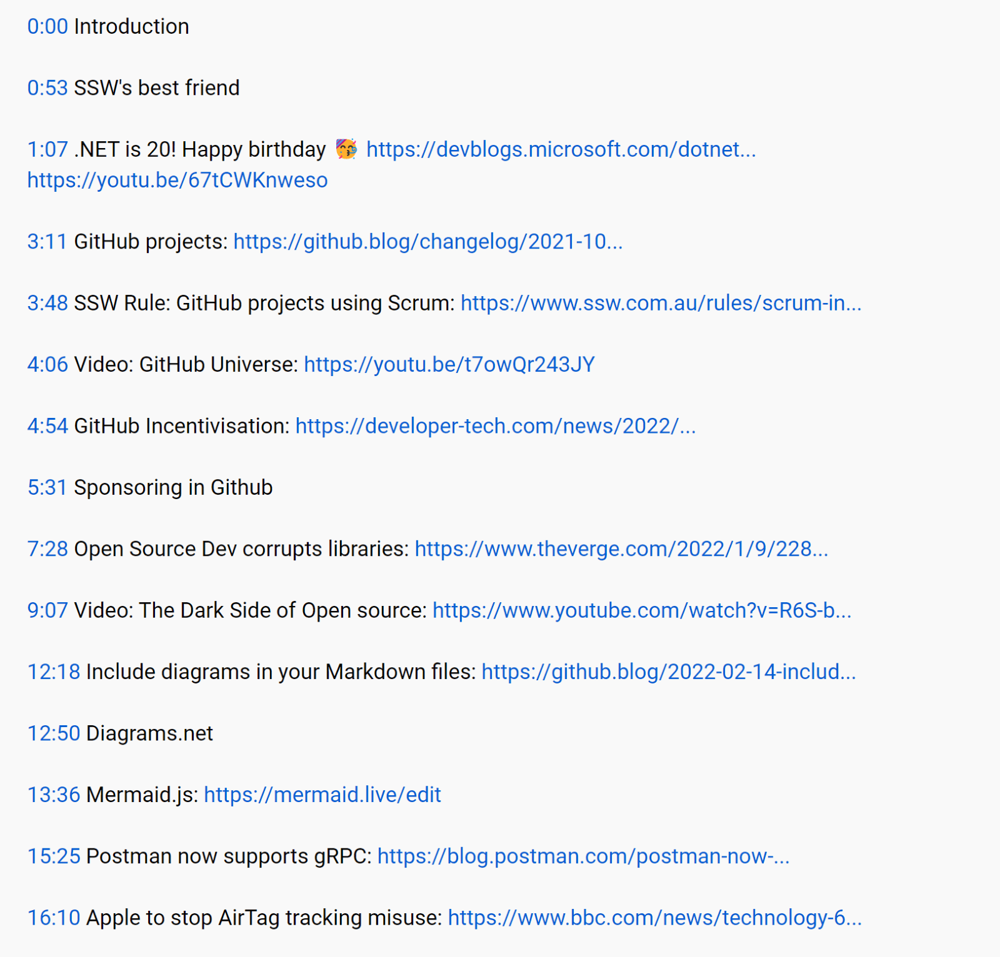

## Before Starting

Make sure you know which hotkey in Premiere Pro hotkey is for markers. The default is set to ‘M’ on your keyboard.

1. Add an Introduction Marker (00:00). YouTube requires every video to have an introduction marker if you want the chapter links to take effect.
   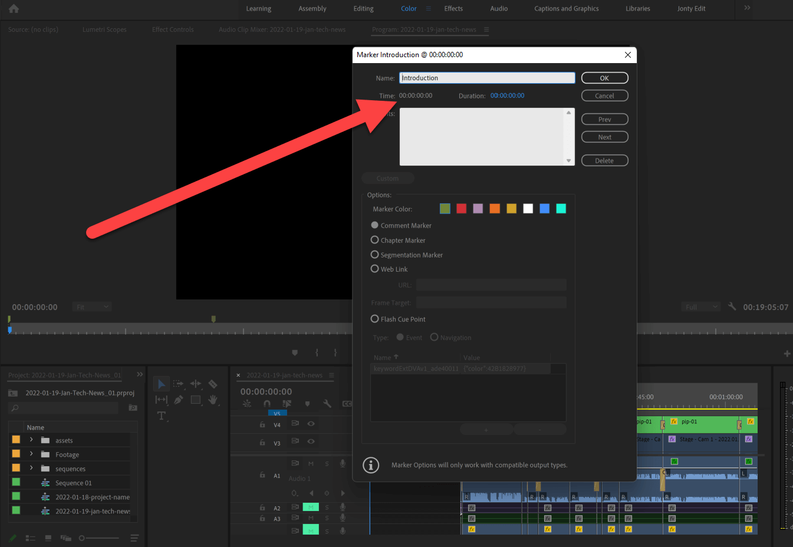
2. Create your chapter markers for every new topic/section in the talk
   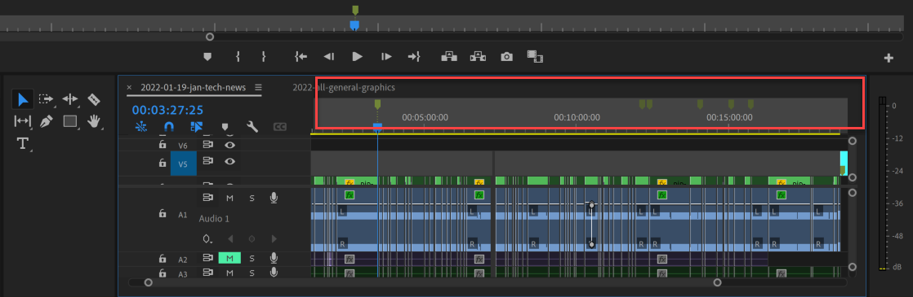
3. Select your sequence | File | Export | Markers
   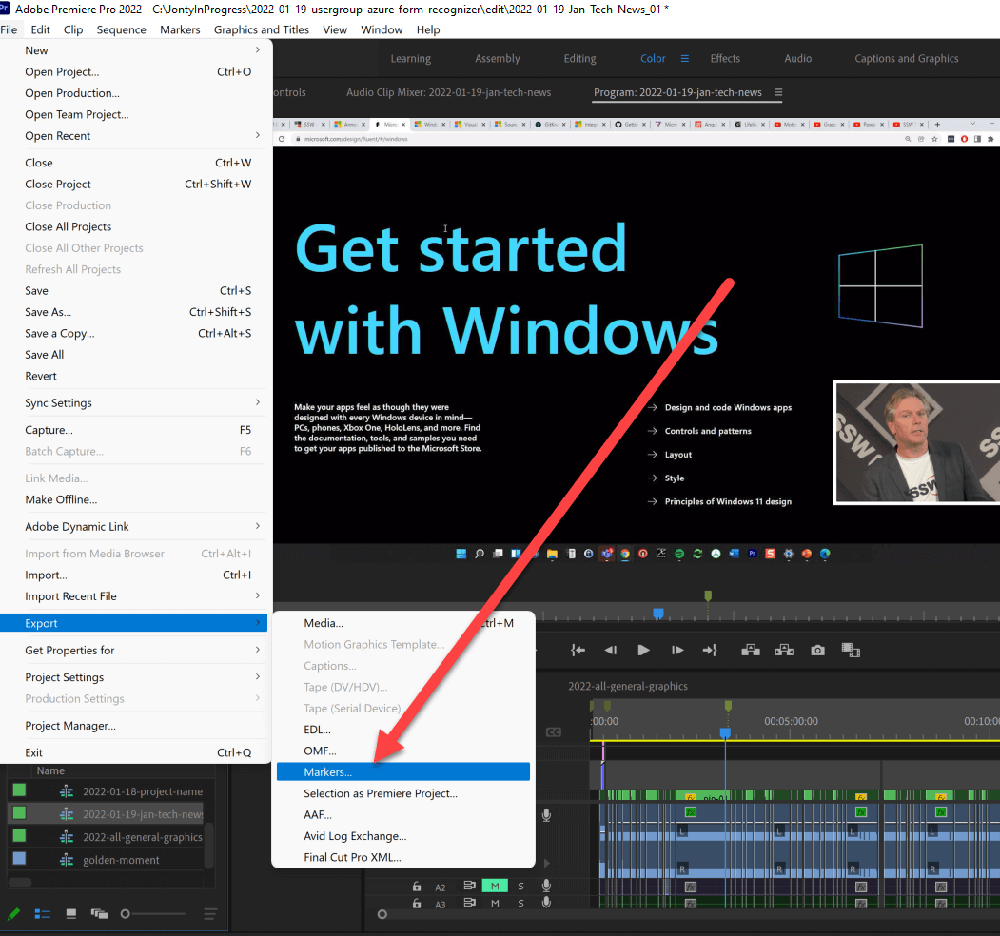
4. File type – CSV | Destination – Export Folder 
   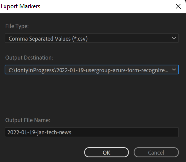
5. Click on this [Spreadsheet ](https://docs.google.com/spreadsheets/d/1JumI4F9eIvolz31MB7wsIaqlwVdaa2ipNNcSO6Cv_OM/edit#gid=1066692544) to find the Premiere Markers to Youtube Annotation (Sample)  

   Alternate Spreadsheet Link: [Premiere Markers to Youtube Annotation](https://docs.google.com/spreadsheets/d/1T58oqSCajCMkbpPuIi6lU4nVPFwYooQY9RiKOeDKu5c/edit?usp=sharing)
6. Make a copy of this excel spreadsheet and save it in your google drive:
   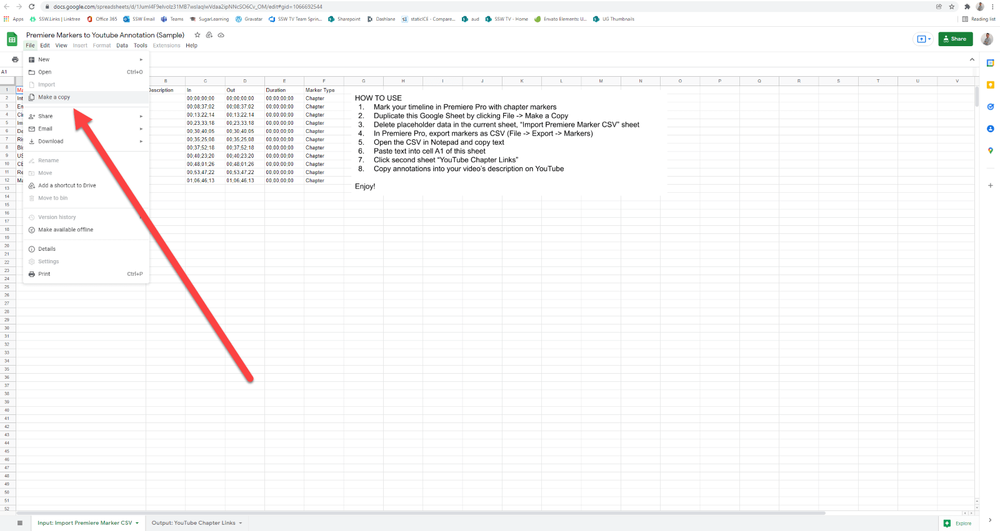
7. Copy the text from your Premiere Pro exported CSV file
   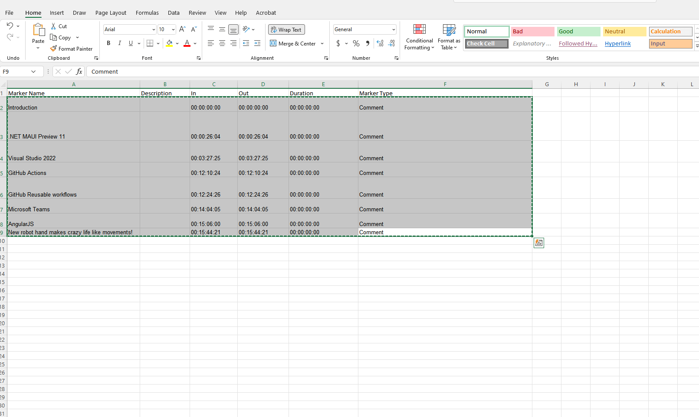
8. Paste the text into your copy of the Premiere Markers to Youtube Annotation excel spreadsheet  

   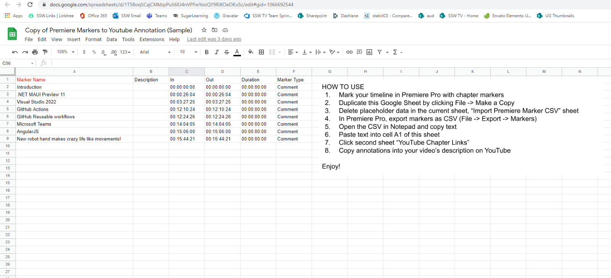
9. Click over to the Output: YouTube Chapter Links and copy the relevant content
   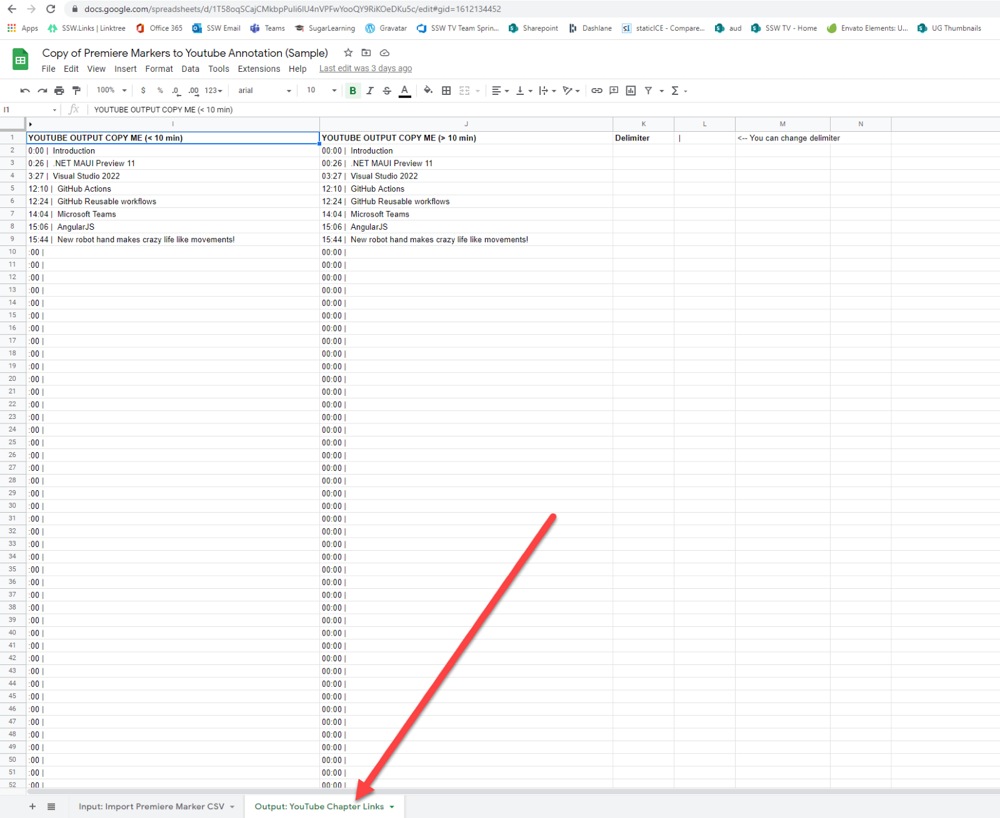
10. Paste into your YouTube Description

    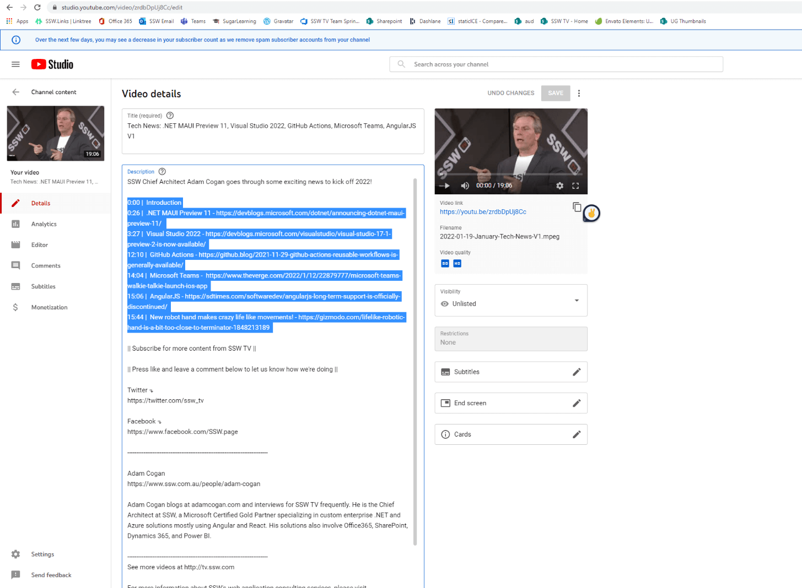
11. The description should look as such: **Note:** The website links were added afterwards manually.

    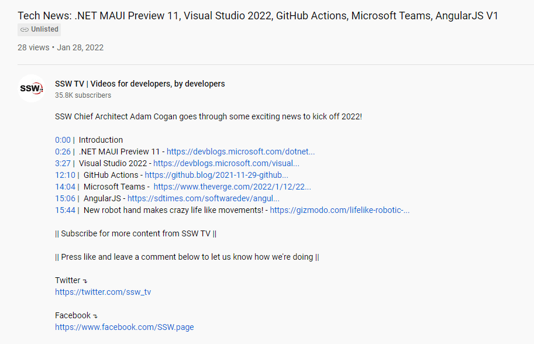