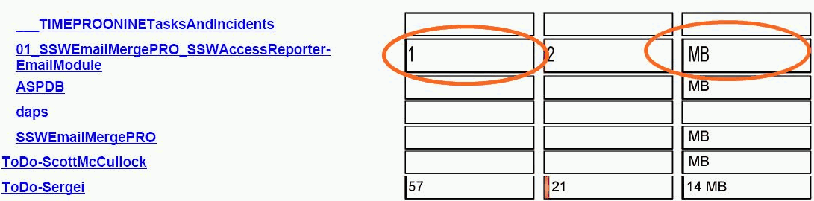
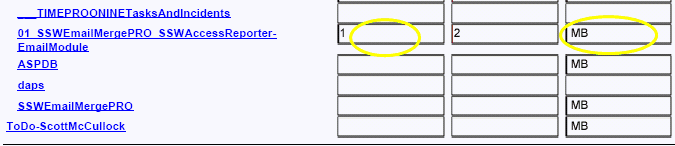

By default charts in table grow with rows. This makes height of charts inconsistent and the report ugly.
<!--endintro-->

::: bad  
  
:::

Putting a rectangle in table cell and placing your chart in the rectangle fixes this problem.

::: good  

:::
