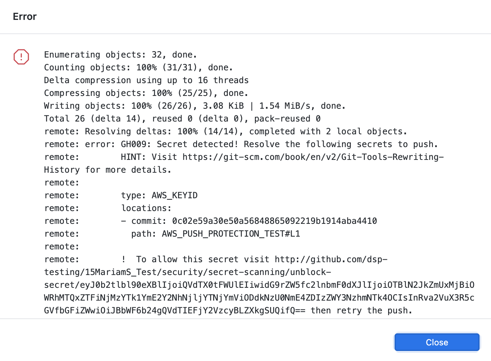

Despite tooling coming a long way to prevent it, accidentally committing a config file with some secrets in it is far too easy to do.

`youtube: CY1_trMEJuM`

**Figure: Up to 2022, GitHub had detected more than 700,000 secrets across thousands of private repositories using secret scanning for GitHub Advanced Security.**

Once this occurs, amongst other things, you need to:

* assume breach
* rotate secrets
* update affected applications
* notify affected parties

This is a lot of stressful work!

On GitHub, what actions do we need to take to make it better?

<!--endintro-->

GitHub Secret Scanning is a freemium feature for public repositories (not configurable). Otherwise, you need to be a GitHub Enterprise Cloud customer with [Advanced Security](https://github.com/features/security) to utilize it.

### How does GitHub know it has found a secret?

Partners can automatically register their secret patterns and get notified automatically when GitHub detect secret with that pattern in a repo. Once notified, the partner can  invalidate the secret. For example, if GitHub found a Octopus Deploy API Key in a repo; it would call a webhook to tell Octopus to invalidate it. There is a long list of supported partners at [GitHub - Secret Scanning Partners](https://docs.github.com/en/enterprise-cloud@latest/code-security/secret-scanning/secret-scanning-patterns)

### Setting up on a public repo (free)

Nothing to configure! GitHub will always send alerts to partners for detected secrets in public repositories.

### Setting up on GitHub Enterprise (with Advanced Security)

Follow the steps on [GitHub - Configuring secret scanning for your repositories](https://docs.github.com/en/enterprise-cloud@latest/code-security/secret-scanning/configuring-secret-scanning-for-your-repositories).

As a bonus, you can shift this left a bit and block developers from pushing code to the repo if GitHub finds a secret in the push. This has the benefit of not requiring secret rotation (as no one else was able to pull the branch). See [GitHub - Protecting pushes with secret scanning](https://docs.github.com/en/enterprise-cloud@latest/code-security/secret-scanning/protecting-pushes-with-secret-scanning).

::: info
If you have secrets patterns that aren't natively supported - you can use regexes to define these custom patterns for GitHub to look out for. See [GitHub - Define custom patterns](https://docs.github.com/en/enterprise-cloud@latest/code-security/secret-scanning/defining-custom-patterns-for-secret-scanning)
:::
