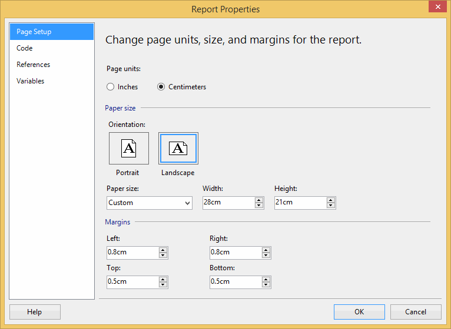
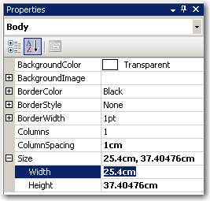
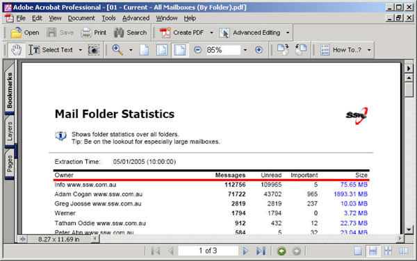
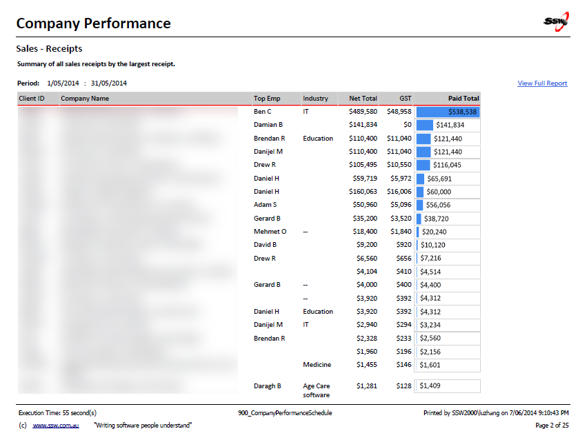

<!--endintro-->

A lot of the time, you will want a hard copy of your reports. Obviously reports are different sizes on screen and on paper, so you need to format your report so it exports to PDF and prints properly. Here's how.

1. Change the report's page width to 28cm (or 11in) and top and bottom margins to 0.5cm.

::: good  

:::

2. Change the Body width to 25.4cm (or 10in)

::: good  

:::

::: bad  
  
:::

::: good  

:::

You can see the 0.5cm margin looks much better than 1cm, and you have more space to organize your content, especailly for a landscape print view.

3. Resize report items (tables and charts) to fit the page. The easiest way to do this is to select (Ctrl+click) all report items that should span the whole width of the page, and set their Width property to 25.4cm (or 10in).

**Tip**: Export your report to PDF and do a print preview, so you don't have to print a lot of testing pages to find out the best page settings.

**Tip**: Remove top and bottom paddings in header and footer text can also give you more space.

**Note**: Reporting Services reports accept both inches and cm, so you can use either.

We have a program called [SSW Code Auditor](https://codeauditor.com/) to check for this rule.
