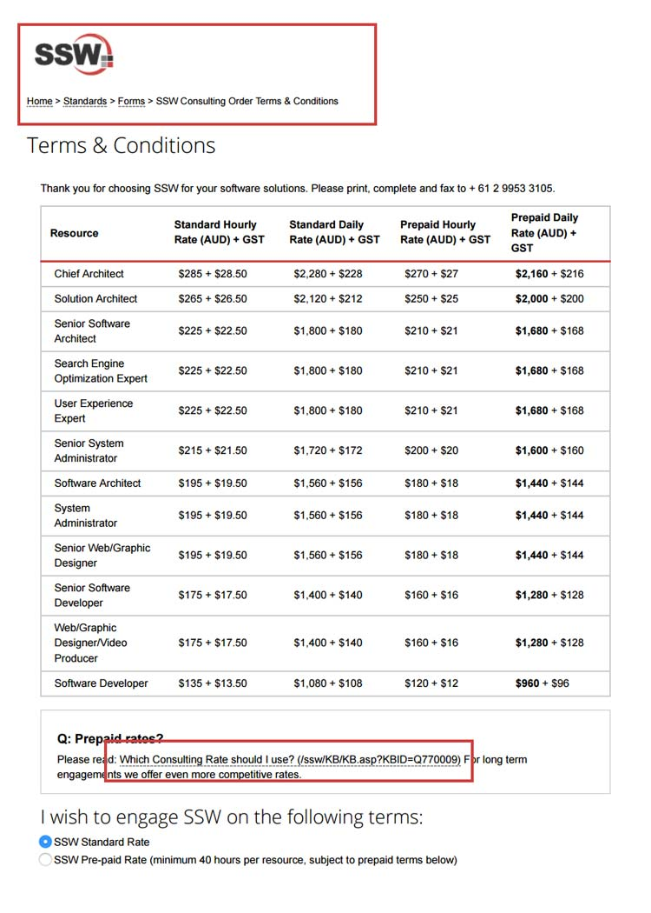

We have a rule on [using relevant words on links](/relevant-words-on-links). How to make sure people will know which words are links and what the links are after printing a page?

<!--endintro-->

As a good practice, you should use CSS to print the URL's next to each link when printing:

```
@media print {
  a[href]:after {
    content: " (" attr(href) ")";
  }
}
```

In specific cases, like on breadcrumbs and logo, you don't want these URL's, so you should override the style:

```
@media print {
  .breadcrumba[href]:after {
  content: none;
}
```
::: good  
  
:::
