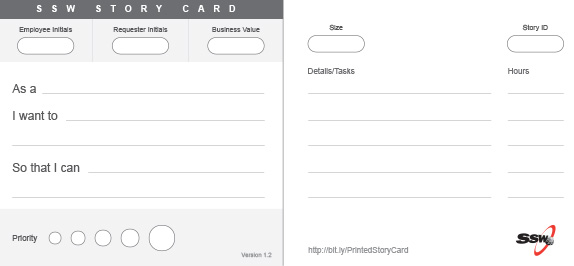

When doing a Spec Review, always bring printed pdf file [SSW Story Cards](SSWStoryCard.pdf).

<!--endintro-->

* Complete the story card with the client
* Teach the clients how to complete story cards by themselves
* Go to Project Portal (E.g. Azure DevOps or GitHub) and enter the story
* Write the Story ID field on the card
* Stick the cards on the project room wall maximizing visibility

