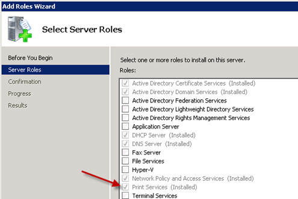
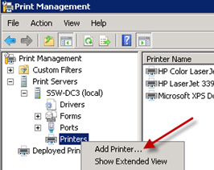

It is important install your printers automatically to all clients that logon to the domain. 
 <excerpt class='endintro'></excerpt> 

This can be achieved via Group Policy. This can be set up easily in​ a Microsoft Windows 2008 Server R2: 

<b>Note: </b>It is better to deploy printers via GPO preferences to end users and also for large-scale environments. There are third-party products eg. Tricerat or Printer Logic which makes centralizing printer queues and servers more efficiently. 

<ul>
<li>From Server Manager add the Print Services role</li>
 Figure: Install the Print Services role
<li>When the role has installed, open Print Management from Administrative Tools</li>
<li>Install all your printers by right clicking on Printers and clicking Add Printer</li>
 Figure: Add all of your printers to the server
<li>Right click on Drivers and choose Add Drivers. From here you will be able to install the x86 and x64 drivers for your printers so all workstations in your organization get the printer drives automatically</li>
 Figure: Add the additional drivers for both x86 and x64
<li>Click on Printers in the menu to get a list of your installed printers</li>
<li>Right click on the first printer you want to install via group policy and click on Deploy with Group Policy</li>
 Figure: Deploying your printer with Group Policy
<li>Next, you need to choose a Group Policy Object (GPO) to add the printers too. You may wish to create a new GPO specifically for the printers, which you can do through the Group Policy Management tool in Administrative Tools</li>
 Figure: Select the Group Policy Object (GPO) to add the printers to
<li>Repeat the last 2 steps for each printer you want to add automatically using Group Policy</li>
<li>Reboot your workstations and the new printers will be added upon login</li>
</ul>

