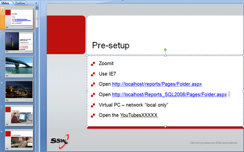

You may be a natural born public speaker, but you will not be able 'wing' a presentation. Setting up a presentation takes time and practice. You want web pages already open, you want VMs ready and demos good to go.

 <excerpt class='endintro'></excerpt> 

  
So document the steps to undertake prior to starting and you will present in a snappier fashion and not need to say the lame statement "hope the demo gods are kind to me today". 

<dl>
    <dt> </dt>
    <dd class="ms-rteCustom-FigureNormal">Figure: Use a Pre-setup slide prior to the presentation and your pace will be snappier</dd>
</dl>

