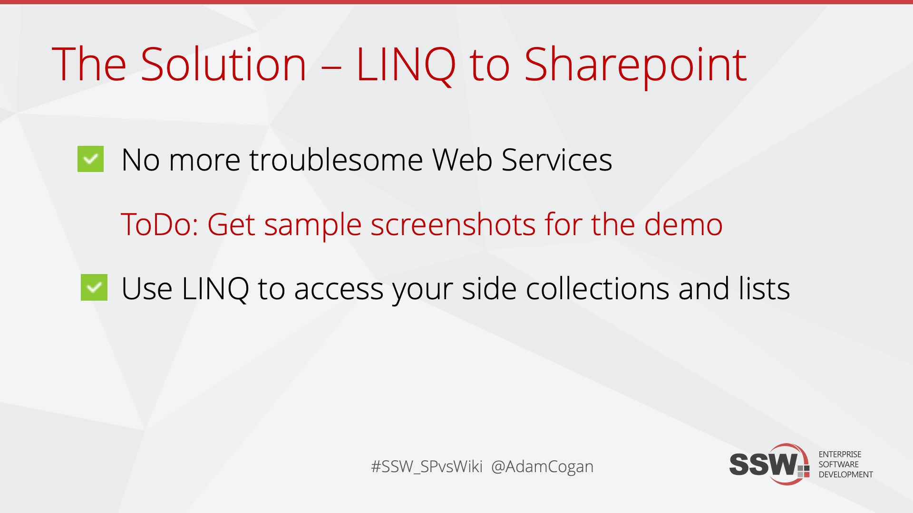

[Create a hashtag](/do-you-know-to-use-hash-tags) for your presentation prior to the presentation and display it your slides! Twitter backchannels are valuable sources of feedback.  

<!--endintro-->

