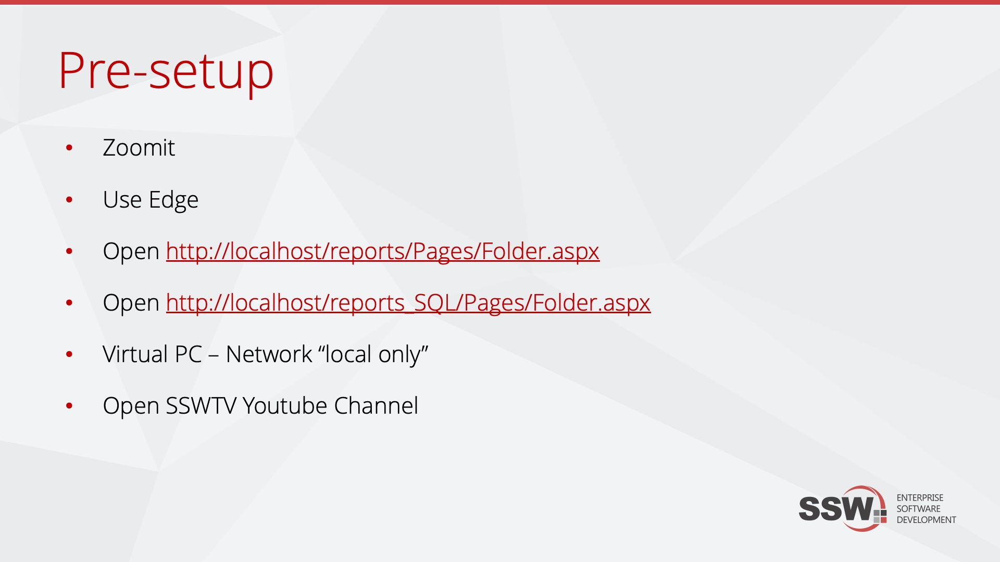

You may be a natural born public speaker, but you will not be able 'wing' a presentation. Setting up a presentation takes time and practice. You want web pages already open, you want VMs ready and demos good to go.  

<!--endintro-->

So document the steps to undertake prior to starting and you will present in a snappier fashion and not need to say the lame statement "hope the demo gods are kind to me today".

