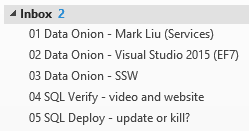
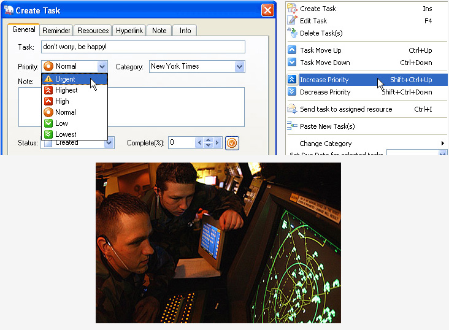

With a mountain of emails, it is difficult to make sure the most important tasks get done first. You want to keep your clients happy while still removing roadblocks for others. 

<!--endintro-->

::: greybox
The word "Urgent" is more important than the word "Important"

:::

  

This is the order which you should work:

1. **Urgent emails** - emails with "URGENT" in the subject e.g. URGENT - the website is down
2. Emails about   [Timesheets](/do-you-know-how-important-timesheets-are)or invoicing issues
3. Your calendar - [keep your calendar up-to-date,](/calendar-does-your-calendar-always-accurately-show-where-you-are)so people know where you are
4. **Your existing clients** - e.g. Normal planned client work and client administration (preferably working on a sprint [backlog](/do-you-know-how-to-manage-the-product-backlog) and Daily Scrums)
5. **Other client work** - Ask others if you can help with their client work
6. **Prospective clients** - project management, answering questions and setting up meetings
7. Internal - all of the following might have their priorities ordered by the Daily Scrum
    1. Quick Important emails to 0 (emails with an important flag &lt; 1 hour and not something that can go into a release plan)
    2. Incomplete [Sprints](http://sharepoint.ssw.com.au/Standards/Management/RulesToBetterScrumUsingTFS/Pages/SprintPlanning%28WHAT%29Meeting.aspx) (was "[release plans](http://sharepoint.ssw.com.au/Standards/Management/RulesToBetterProjectManagement/Pages/DetailedReleasePlan.aspx)") e.g. Normal planned internal work
    3. Important emails to 0
    4. Help others get their important emails to 0
    5. Get your inbox to 0
    6. Ping others to see if they need help completing their [Sprint](http://sharepoint.ssw.com.au/Standards/Management/RulesToBetterScrumUsingTFS/Pages/SprintPlanning%28WHAT%29Meeting.aspx)
8. Phew... Done...

::: greybox
Tip #1: Don't move an important task out of your inbox unless:

:::

* Someone else is going to do it right away; or
* It is going into a Sprint

::: greybox
Tip #2: Use inbox subfolders to group and prioritize tasks 

:::

::: good  
  
:::

::: good  
  
:::

Also, it's common that priority orders change, but clients don't always mean to, so double check that the client means this.

::: greybox
When someone is asking you to do a new task, and you are still working on some other task, you should ask:

"Are you changing the priority order? Do you want this new task done before the current task I'm working on, which is xxx."  
:::
Figure: Confirm with the client "Are you changing the prior order?"

::: good  
  
:::
