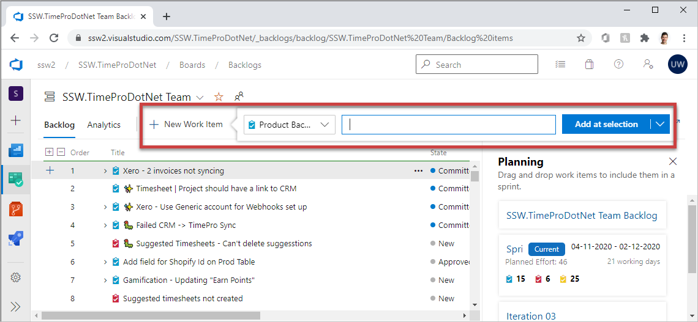

The Product Owner is responsible for owning the Product backlog. See the video on ["Do you know how to be a good Product Owner?"](/do-you-know-the-how-to-be-a-good-product-owner)

How to add new PBI (Product Backlog item) to the backlog?

<!--endintro-->

**Do not use emails** as you can't order them by the business priorities.

**Use Azure DevOps** (E.g. https://ssw.visualstudio.com) as it allows you to enter an item into the backlog, in the preferred priority order.

::: good

:::

**Note:** You can also create a PBI using Azure DevOps and attach an email directly if needed, without using Team Companion
