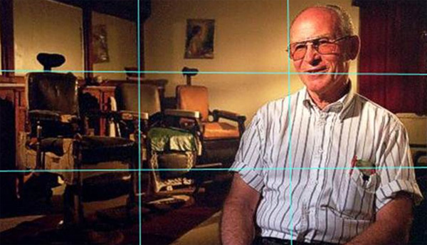
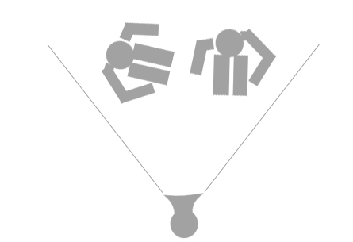

When filming a subject (or subjects) there are numerous ways to frame them. 

<!--endintro-->

Basic rules to follow include:

1. Avoid positioning them on opposite, far sides of the frame, as this creates a feeling of emotional distance between the two characters. Distances seem bigger in the camera, so position your subjects as close together as they are comfortable with, especially if you are using tight framing and/or filming with one camera.
2. By using the rule of thirds, you can create more visually pleasing shots. That is, if you divide the x and y axis's into 3 segments, the lines diving these segments should align with certain lines in the image. The intersection of these lines is a good place to position a focal point such as someone's eye.
3. Avoid too much space in the frame, especially if space has nothing in it. This is referred to as Dead Space. This can occur when the subjects are placed in front of a blank wall.
4. If you can (such as if you have access to 2 or more cameras) avoid filming directly side on, at 90 degrees to the subjects. Always try to be as a face on with your subject as possible.
5. Try and have an interesting background. Patterns, movement, and depth can help to create a more interesting shot.
6. For corporate and educational videos, a mid-shot works well to capture the content. This is from the bellybutton up.
7. Avoid areas of high contrast - a hot spot (where the light is concentrated into a pure white) or a very dark spot or section of the frame in a predominantly light frame can draw the viewer's eye. If this is not what you want them to focus on, don't include it in the frame.
8. If there is only one person in the frame (or if there are two people looking the same direction), place them on the opposite side to the direction they're looking for. That is if they're looking left to right, place them on the left side of the frame. If this is not followed, your subject will be pressed up against the edge of the frame and this can create an uncomfortable feeling for the audience.

<dl class="badImage">&lt;dt&gt;&lt;/dt&gt;<dd>Figure: Bad example – too much dead space, the characters are unevenly placed, there is an uninteresting background, it's side on and the framing is too far out</dd></dl><dl class="goodImage">&lt;dt&gt;&lt;/dt&gt;<dd>Figure: Good example – the rule of thirds followed, mid-shot, interesting background, no dead space, fairly face on, subject placed on the right side because he's looking from right to left (leading room)</dd></dl>
When positioning your subjects it is important to remember several factors:

1. It is a good idea (if you want to have one of your subjects more face on) to have the interviewee more face-on than the interviewer.
2. The interviewer should be on the right side of the frame - you'll notice talk show hosts will always look right to left.
3. The interviewer should avoid leaning into the interviewee too much as it might make them feel uncomfortable and seem a little weird in the frame.
4. The best way to position your subjects is at 90° to each other and at 45° to the camera:

<dl class="badImage">&lt;dt&gt; &lt;/dt&gt;<dd>Figure: Bad example - Interviewee (left) is facing toward the interviewer (right) too much and the interviewer is faced towards the camera too much</dd></dl><dl class="goodImage">&lt;dt&gt; &lt;/dt&gt;<dd>Figure: Good example - position your subjects properly to create an unbiased interview</dd></dl>
When doing an over the shoulder shot (OTS) for a corporate video, it is generally best to stay at a level height with the subject. Looking up or down at them can create unnecessary meaning in the shot. It is also a good idea to avoid using the wide-angle setting on your camera as it makes the subject seem distant and small in comparison to the person whose shoulder we can see.
<dl class="badImage">&lt;dt&gt; &lt;/dt&gt;<dd>Figure: Bad example – looking down at the subject with a wide-angle lens setting</dd></dl><dl class="goodImage">&lt;dt&gt;&lt;/dt&gt;<dd>Figure: Good example – level height, zoom level not set to wide-angle</dd></dl><dl class="badImage">&lt;dt&gt;&lt;/dt&gt;<dd>Figure: Bad example – head not close enough to the top and hand gestures not visible</dd></dl><dl class="goodImage">&lt;dt&gt;&lt;/dt&gt;<dd>Figure: Good example – head close to the top and hand gestures visible</dd></dl>
