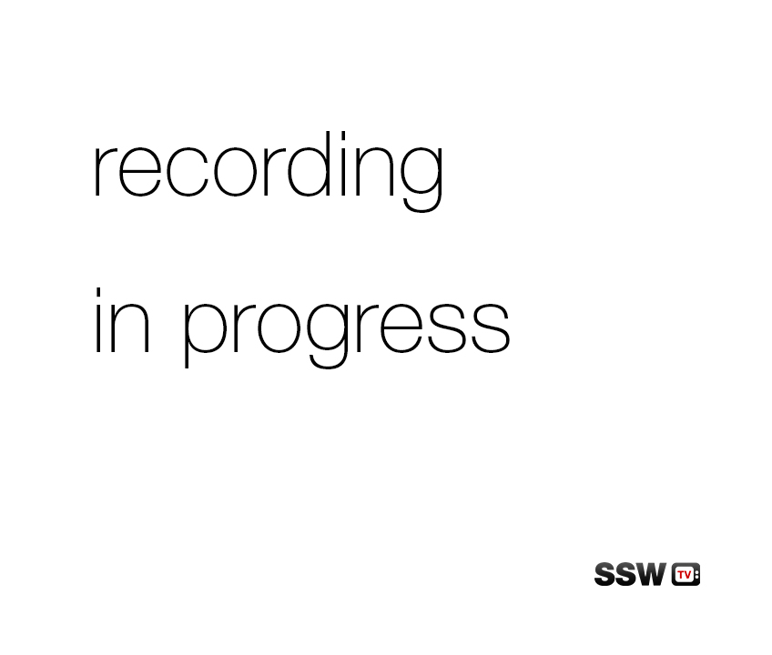

Unwanted noises such as people walking and talking can ruin a recording. If you have this problem, the best way to avoid it is to use a recording in progress sign that informs people who are passing through the area that they need to be quite and/or leave the area. 
<!--endintro-->

[[badExample]]
| 

[[goodExample]]
| !'.
