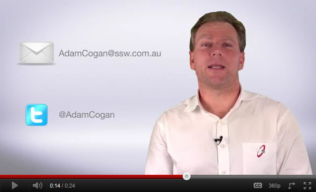

Without a 'call to action' (viewers to do something at the end of a video) the purpose of the video is lost. So you don't waste all your hard work editing, you should include a CTA at the end.

Common objectives are to:

* Obtain the viewer's email address
* Get the viewer to provide info and request a service from the company
* Get them to subscribe to the company's social media pages

<!--endintro-->

A good 'call to action' should:

1. Be short (no more than 30 seconds).
2. Not have too many options - a visitor is much more likely to do a task if he's not confused by being given dozens of social media options.
3. (Optionally) Tell them they get value. E.g. if they comment they will make a difference.
4. If you have a paid subscription offering or a free one like YouTube) give incentives to subscribe now, along with the benefits subscribed users get.
5. Remember that people have different preferences for social media. You pretty much need to cover your bases. Have a Twitter page, Facebook page, LinkedIn account, YouTube channel, etc. Of course, don't have all these in the 'call to action', but make sure that those options are easily accessible.
6. If you are using YouTube or another service that provides the option to have annotations, use annotations that prompt the viewer to comment or subscribe. A 'subscribe' link in the annotation gets more subscribers

::: greybox
Thanks, have a good one!
:::
::: bad
Figure: Bad example – No call to action
:::

::: greybox
Please leave a comment, and go to our website, Facebook, YouTube, Twitter, and LinkedIn. Also please sign up for our newsletter.
:::
::: bad
Figure: Bad example - Too many options breeds choice paralysis
:::

::: good

:::
