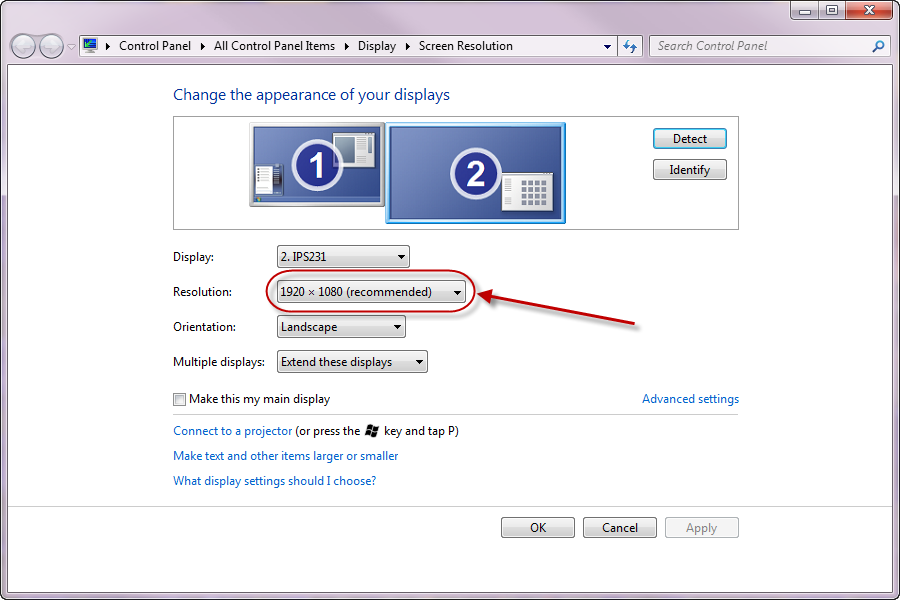
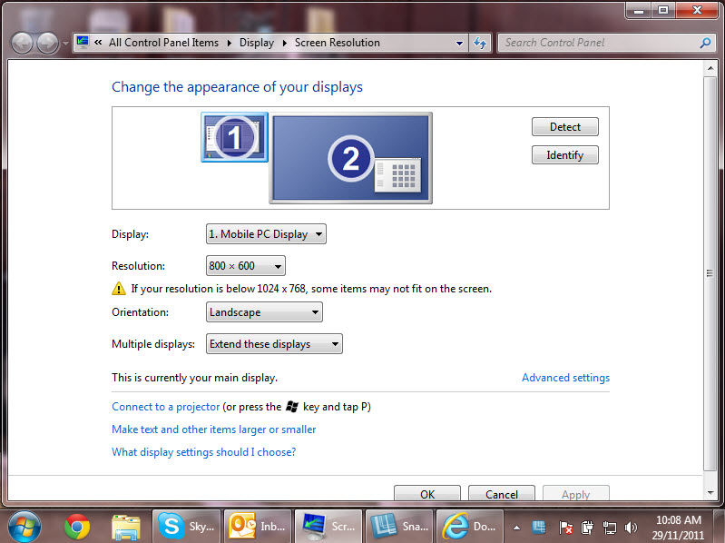
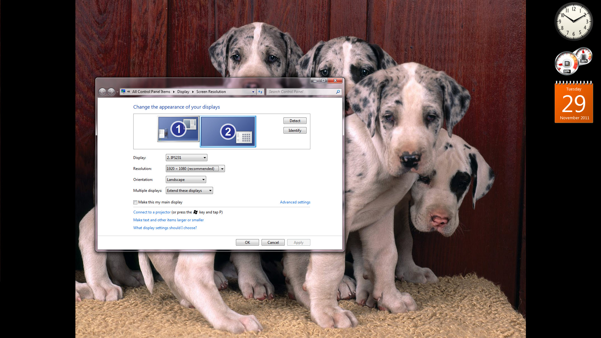

Read the tutorial: [Learn the Camtasia recording process, complete basic video edits, and successfully share a video](https://www.techsmith.com/learn/tutorials/camtasia/record-edit-share).

OR

Follow these steps to start recording using Camtasia:

<!--endintro-->

### Windows Display Settings

1. On the monitor you will be using for your video, set your screen resolution to 1920x1080.

If your screen resolution is too low then it will be difficult for people to follow the video, and you may need to record it again.

  

::: bad  
  
:::

::: good  
  
:::

### Camtasia

**Note:** We recommend you use Camtasia 2019 or above.

1. Start Camtasia and check the following settings:
    * Screen:
      * Check that the correct screen is selected and set to Full Screen
    * Camera:
      * Check correct camera is selected
      * Check height – it should be at eye level
      * Check framing as per: [ssw.com.au/rules/production-do-you-know-the-correct-way-to-frame-your-subject](/production-do-you-know-the-correct-way-to-frame-your-subject)
      * Check lighting as per: [ssw.com.au/rules/have-good-lighting-on-your-home-office](/have-good-lighting-on-your-home-office)
    * Audio:
      * Set up your audio environment as per: [ssw.com.au/rules/record-better-audio](/record-better-audio)
      * Microphone - Check correct device is selected (e.g. Blue Yeti USB microphone)
      * Microphone - Check volume levels - audio should be in the green range and responding to changes in audio. If the range is orange or red you will need to turn down your microphone. [See here for more information](https://assets.techsmith.com/Docs/pdf-camtasiaStudio/Get_Great_Sound_with_Camtasia_Studio_8.4.pdf)
      * System Audio - You will need this enabled if your presentation needs computer sounds (e.g. playing a YouTube video)

2. Test record:
    * Watch back to check audio and video

3. Prepare what you are talking about:
    * Rehearse your content!
    * Look into the camera when you start, finish, and when you are talking to the audience
    * Be friendly and smile 😊
    * Make sure your introduction is clear, full of energy, and without errors.
    * Keep the energy up, but don’t rush. *TIP: Before recording, take a deep breath.
4. Record as per: [/record-a-quick-and-dirty-done-video](/record-a-quick-and-dirty-done-video)
5. Watch your video back so you can record again if needed.
    * Write edit notes
    * Write the best sections
6. Copy the source files to the server, as per: [/post-production-do-you-know-how-to-structure-your-files](/post-production-do-you-know-how-to-structure-your-files)

::: greybox
**Tip:** Alternatively, you can use [Loom](https://www.useloom.com/), which works as a Google Chrome extension.
:::
