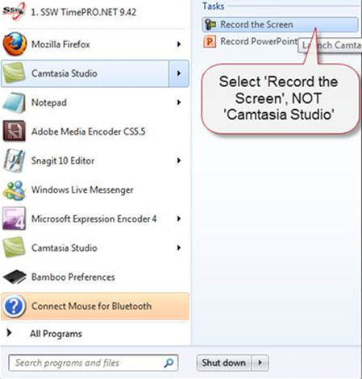
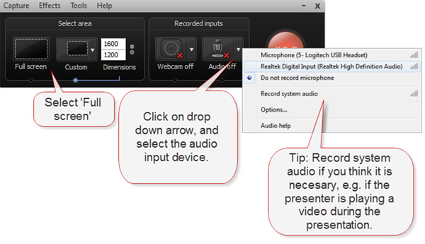
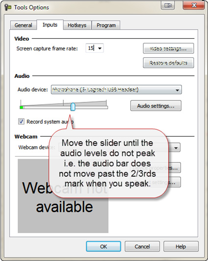
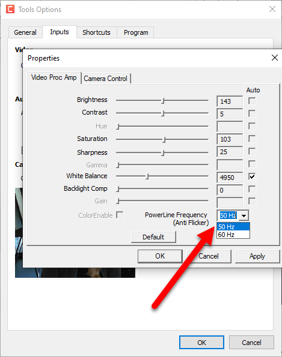

Follow these steps to start recording using Camtasia: 

<!--endintro-->

1. Set your screen resolution to as high as possible but do not exceed 1920 x 1080 for a 16:9 display, or 1920 x 1200 for a 16:10 display. If your screen resolution is too low then you will either have to expand the footage in post-production (which will result in a loss of quality) or release a low-resolution video (which will become poor quality when watched in full screen).

  

::: bad  
  
:::

::: good  
  
:::
2. Start 'Camtasia Recorder' 
      
  

3. In the Recorder window, select 'Full Screen', then turn on the mic. Choosing which mic input to use depends on the type of recording you are doing. If you are filming the session, you should select the internal mic since you will be using this for syncing purposes. If however you are just recording your screen with audio, then select an external mic since this will be higher quality. 
      
  

4. Select Tools | Options
5. In the 'General' tab, uncheck the 'Show tooltips' box and check the 'Disable screensaver during capture'.
6. Next step is to select the 'Inputs' tab at the top of the dialog. Set the frame rate to 15. Set the microphone level using the slider. Note: Set the frame rate to 30 if the presentation will contain motion such as video or moving graphics.

  
7. On the ‘Inputs’ tab, select ‘Device Properties’.
8. On the ‘Video Proc Amp’ tab, check the Frequency setting is correctly configured – 50Hz if you are located in Australia or China.
   
  

   This setting ensures that the camera frame rate is in sync with electrical devices (such as fluorescent lights) in order to prevent flickering.
 **Note:** If you are located in America, or anywhere that uses a 60Hz electricity supply, you will need to select the 60Hz setting.
9. After you have done all these things, click on 'OK', and then hit the big red 'Rec' button to start recording!

::: greybox
 **Tip:** Alternatively, you can use     [Loom](https://www.useloom.com/), which works as a Google Chrome extension.     

:::

### Related Rule

* [Do you know how to record the screen on a Mac?](/do-you-know-how-to-record-the-screen-on-a-mac)
