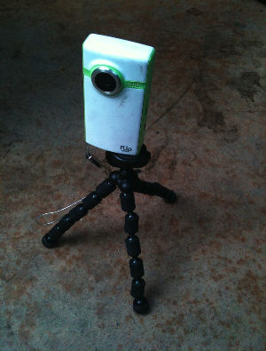

To create more visually pleasing videos consider using a multi camera setup.

The benefit is that you can use the second camera to 'cut away' to (see rule on [using cutaways](/use-cutaways)) in the edit.

<!--endintro-->

If you are recording a long interview use two (identical) cameras, covering both the presenter and the interviewee.

  

If you are recording an event with multiple people and want to maximize the coverage (and obtain cutaway shots) use a second/third camera, either placed on a tripod somewhere of interest or give to someone else to move around with and obtain interesting shots.

Camera 3 should be identical to Camera 1 if available (it is still possible to use two different cameras but this may cause some quality compromise in the form of different colours for each). An iPhone can provide the necessary shots to make a video more interesting, but only use iPhone 7 or later footage if proper lighting, exposure & composition can be achieved (Please see rule about [the correct way to frame your subject](/production-do-you-know-the-correct-way-to-frame-your-subject).)

