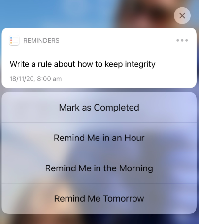
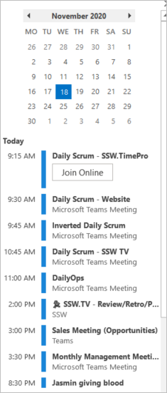

Once you’ve internalized the importance of [having professional integrity](/professional-integrity), you may feel like you are suddenly under a lot of pressure to keep your word, and this can be stressful.

<!--endintro-->

There are many tools and techniques you can use to help you succeed at this, and also to take some of the pressure off.

## Remembering to do what you promised

Trying to keep all your commitments in your head is difficult and stressful, but if you use systems that offload them, you can free up mental power to get things done in the meantime.

### Use Siri (or Google) reminders

Generally used for small tasks that you can't complete right now. These are very quick to set, and so won’t interrupt your flow.

Make sure you never dismiss these when they come up unless you can complete the task on the spot. If you can’t complete the task immediately when it appears on your lock screen, press and hold to kick the can down the road to when you will have time to do the task.

::: good

:::

### Use calendar appointments (with reminders)

If you want to set aside time for something, especially with 1 or more other people, use a calendar appointment. Remember, that action in itself is a promise that you will be on time (and not excessively multitasking), so keep on track of your upcoming appointments in Outlook, or use reminders to make sure you don't forget.

::: good

:::

See more on our [Rules to Better Calendars](/rules-to-better-calendars)

### Use FollowUpThen

Seeing as professional integrity doesn't just mean getting work done, but getting it done within an agreed timeframe, you can use a free service called [FollowUpThen](/do-you-follow-up-emails-effectively) to help in a number of ways.

1. Getting emails out of your inbox until you're ready to act on them
2. Reminding you when it's time to follow up someone else (remember TOFU - Take Ownership and Follow Up)
3. Sending a To Myself email that will only arrive when you think you'll be ready to action the work

## Doing the full task

Misunderstandings around what was asked vs what was delivered are very common, but there are tools to make sure you minimize these:

### Send "To myself" emails (or create Product Backlog Items)

As soon as you commit to do something, to make sure you immediately document the task in a way that the person who gave it to you can see the details. This could be on a shared Trello Board, a work tracking system like Azure DevOps or Jira as a PBI, or as simple as an email to yourself, with the person CC'd.

See more on the [to myself rule](/dones-do-you-send-yourself-emails).

### Use Scrum tools - Definition of Done and Acceptance Criteria

Scrum is an Agile Project Management methodology that is all about delivering software features, so of course making sure that the Product Owner and the Team have the same expectation of what will be delivered is key. There are 2 ways of doing this:

1. Definition of Done - This is for things that apply to all (or most) features, such as "It has been deployed to Staging", "It has been tested", etc.
2. Acceptance Criteria - This is for details that are specific to this particular feature, such as "The user can login using Facebook auth", etc.

See more on [Rules to Better Scrum](/rules-to-better-scrum-using-azure-devops)

### Add buffers (aka healthy pessimism)

Once you start thinking in terms of professional integrity, you will always be trying to under promise and over deliver, and the easiest way to do this consistently is to start adding some contingency buffers to your estimates.

* Change from "I'll be there in 5 minutes" to "I'll be there in 15 minutes"
* Change from setting 30 minute appointments to 1 or 2 hour appointments when needed
* Change from estimating best case scenarios to closer to worst case scenarios

### Don't over-commit

When your intention is no longer to try your best to get everything done, but to promise to get things done, you need to make sure you don't take on so much that you set yourself up for failure. Don't always say **yes**.

Your default mode should be that if you say you'll do something, you check to see that you actually have capacity to do so. If you're not sure you'll be successful, either say **no**, and renegotiate a more realistic deliverable or date, or else specify that you're not sure you'll be able to commit to that, but you will **try**.
