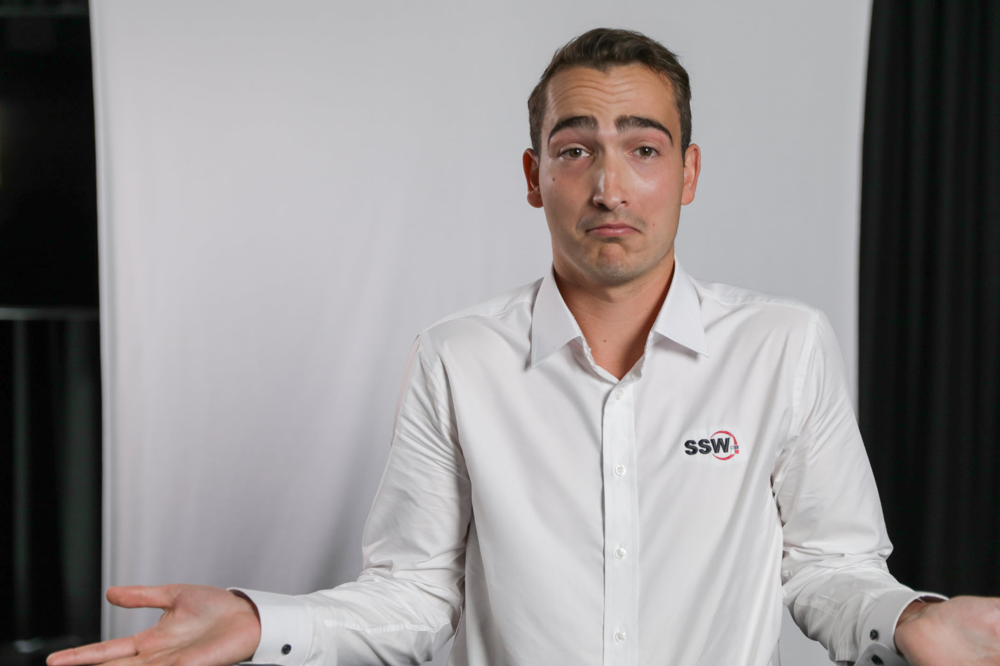
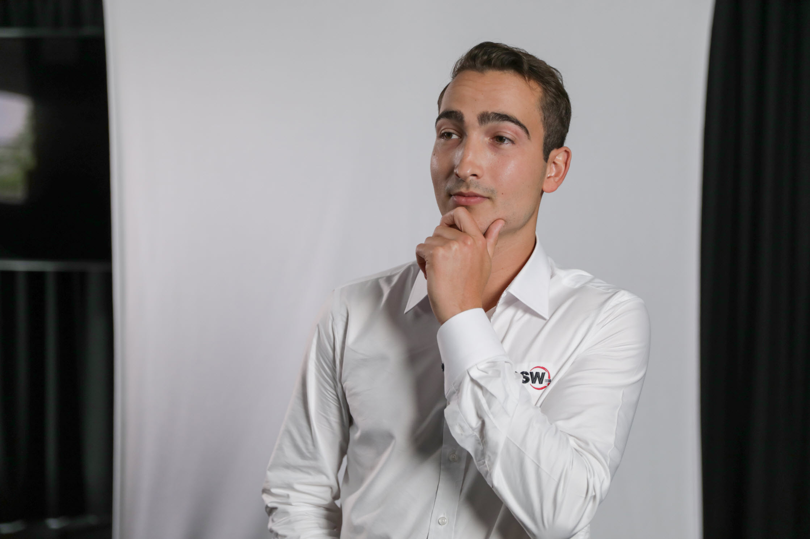
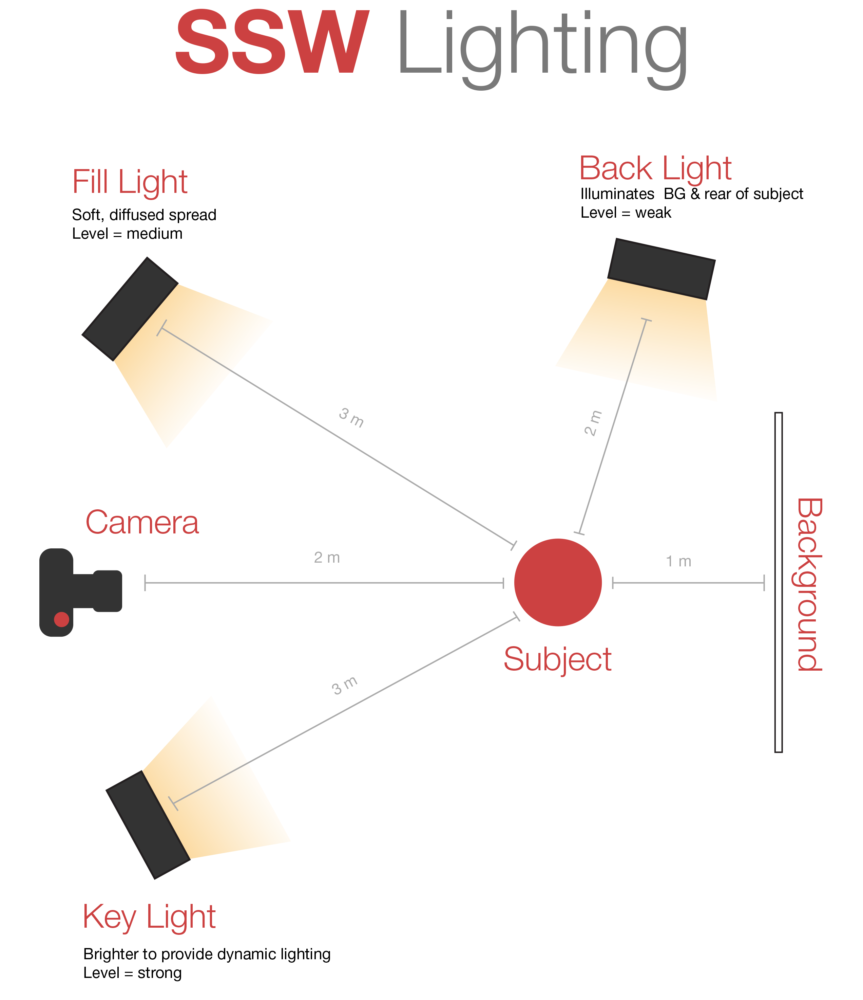
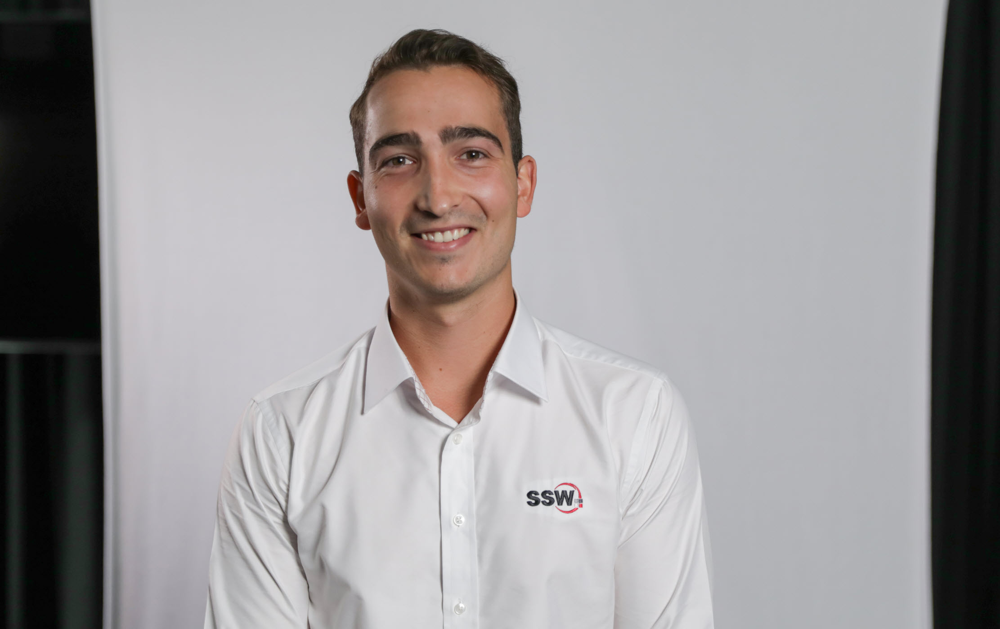
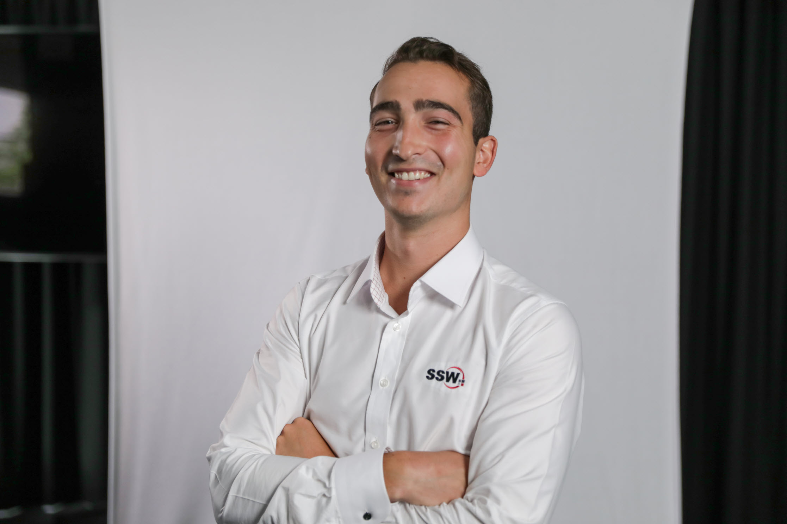

Your employees are the face of the company, so having profile photos that are consistent and high quality will improve your company's profile. 

### Camera Settings

Profile photos are used to provide a human connection element, so it is best to have a photo that is as close to real life as possible.

1. Focal Length: **35mm – 50mm lens** (full frame equivalent)
   As per [The Camera Versus the Human Eye](https://petapixel.com/2012/11/17/the-camera-versus-the-human-eye/), the closest focal length to a human eye is 43mm, so profile photos in the above range will look the most realistic.
2. Shoot in **RAW**: Many cameras (and some phones) allow you to shoot in raw mode, which captures all the sensor data, instead of compressing it to a small image file like jpg. This allows more flexibility when editing.
3. ISO: **Ideal ISO 100 – 800** (or the camera’s native ISO), Max ISO 6400
   The ISO is the sensor input sensitivity levels (or gain). A higher level will capture more light, but will also make the image noisy/grainy:

**[Figure: Noise/grain levels increasing as the ISO increases](https://fstoppers.com/education/do-you-know-maximum-acceptable-iso-value-your-camera-338275)**

### Background

1. Use a plain background (e.g. white or a light neutral colour). 
   This will provide a nice clean aesthetic, and will make it easier to edit out the background for transparent assets (e.g. for creating graphics, presentations, and video thumbnails).
2. Keep the subject a few steps in front of the background to avoid shadows (see lighting plan below)
3. Ensure the subject is surrounded by the background to reduce the load for editing.

### Lighting

1. Use three-point lighting to ensure the subject is dynamic and well-lit:

   * Key light: Primary light source in front of subject that highlights one side.
   * Fill light: Diffused even light source in front of subject to illuminate all dark areas.
   * Back light/ Hair light: Accent light source behind the subject to separate them from the background.

### Posing

There are 2 poses suitable for the profile photos:

* Direct to camera
* ¾ angle to camera

Below are instructions to give to your subject to get them in the correct position:

**Direct to camera**

1. Point your hips towards the camera (this will align them straight to camera)
2. Keep your shoulders back (this will straighten their posture)
3. Point your chin towards the camera (this will elevate their head & reduce neck wrinkles)

**¾ angle to camera**

1. Point your hips a quarter turn towards the fill light/away from the key light (this will give their body a more dynamic posing)
2. Keep your shoulders back (this will straighten their posture)
3. Look towards the camera (this should rotate their head to face into the camera)
