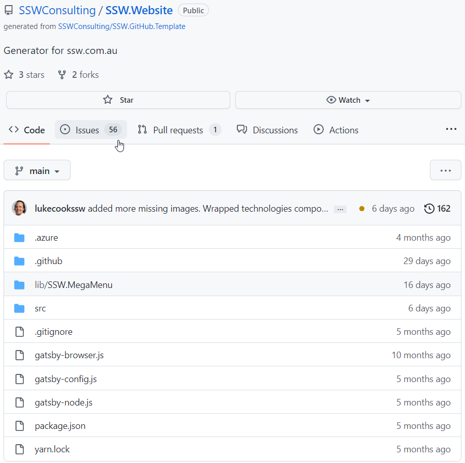
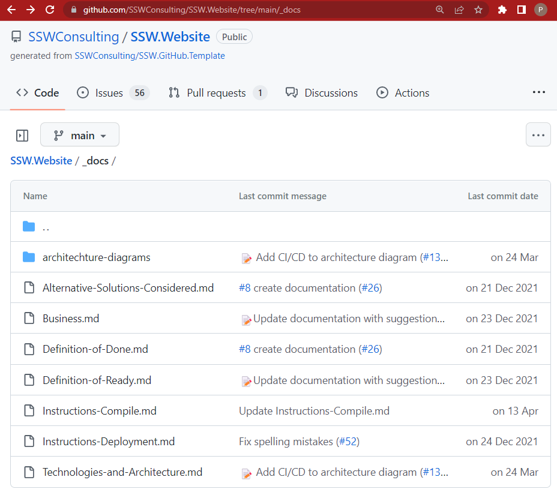

Developers jumping onto a project want to have a great first experience getting things going. Sadly, lots of projects are missing key details that are needed to make setup easy.

Let's look at the ways to optimize the experience:

<!--endintro-->

There are 3 levels of experience that can be delivered to new developers on a project.

### Level #1 - Step by step documentation

Level #1 is the most important milestone to reach because it contains the bare minimum to inform developers about how to run a project.

The rule [Do you make awesome documentation?](/awesome-documentation) teaches us all the documents needed for a project and how to struture them.

The README.md and Instructions-Compile.md are the core documents that are essential for devs to get running on a project.

::: bad  
  
:::

::: good  
  
:::

Tip: In addition to pre-requisites, make sure to mention what isn't supported and any other problems that might come up e.g.

::: greybox
Problems to check for:
- Windows 8 not supported
- Latest backup of the database
- npm version
:::

Tip: Don't forget about the database, your developers need to know how to work with the database

### Level #2: Less documentation (and Get Latest and compile with a PowerShell script)

A perfect solution would need no static documentation. Perfect code would be so self-explanatory that it did not need comments. The same rule applies with instructions on how to get the solution compiling. A PowerShell script is the first step towards this nirvana.

Tip: All manual workstation setup steps should be scripted with PowerShell (as per the below example)

Tip: You should be able to get latest and compile within 1 minute. Also, a developer machine should not HAVE to be on the domain (to support external consultants)

::: greybox
PS C:\Code\Northwind&gt; **.\Setup-Environment.ps1** 

Problem: Azure environment variable run state directory is not configured (\_CSRUN\_STATE\_DIRECTORY).
 
Problem: Azure Storage Service is not running. Launch the development fabric by starting the solution.
 
WARNING: Abandoning remainder of script due to critical failures.
 
To try and automatically resolve the problems found, re-run the script with a -Fix flag.

:::

::: good
Figure: Good example - A PowerShell script removes human error and identifies problems in the devs environment so they can be fixed
:::

### Level #3 Docker Containerization

PowerShell scripts are cool, but they can be difficult to maintain and they cannot account for all the differences within each developers environment. This problem is exacerbated when a developer comes back to a project after a long time away.

Docker can solve this problem and make the experience even better for your developers. Docker containerization helps to standardize development environments. By using docker containers developers won't need to worry about the technologies and versions installed on their device. Everything will be set up for them at the click of a button.

### Level #4 Dev Containers
Dev containers take the whole idea of docker containerization to another level. By setting up a repo to have the right configuration, the dev team can be certain that every developer is going to get the exact same experience. To learn more read the rule on [dev containers](/dev-containers)
