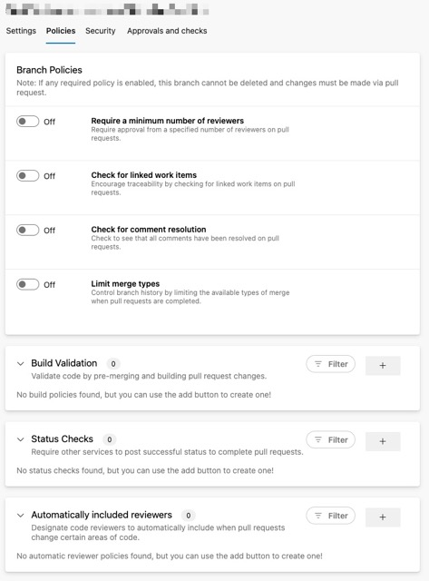
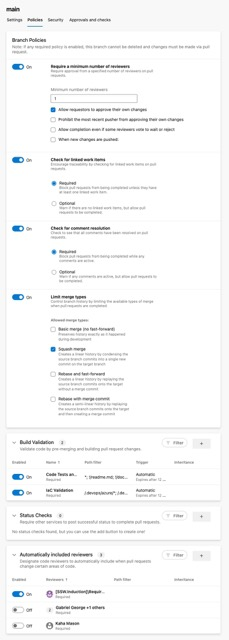

Branch protection is a feature in version control software that allows teams to define rules and restrictions around who can make changes to specific branches, what types of changes are allowed, and if there are conditions that have to be met.

<!--endintro-->

This can include:

- Number of reviewers
- Linked work items e.g. PBIs (super useful to track back to why the code was changed)
- Any feedback has been addressed/resolved
- Enforcing specific merge types
- Checking that builds pass
- Checking other services e.g. code quality like SonarQube
- Automatically adding specific people to review the code

::: bad  
  
:::

::: good  
  
:::
