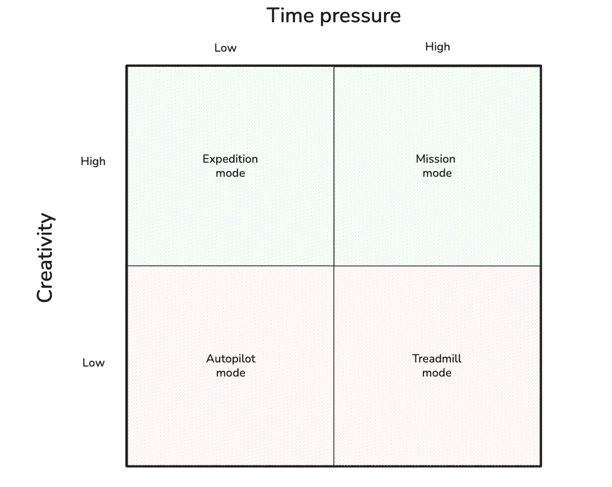

Creativity doesn’t just happen—it needs the right conditions to grow. When time pressure kicks in, managing it well can make the difference between a brilliant idea and a burned-out team. This rule explores how to support creativity even when deadlines are tight.

===> TODO: add video here
**Video: Do you protect your team's creativity? (X min)**

## Why creativity matters in software development?

Creativity is essential in software development because it helps us move beyond routine solutions and solve problems in smarter, more effective ways. From building intuitive features to fixing elusive bugs, creative thinking drives innovation and keeps our systems adaptable and competitive.

A classic example comes from outside our industry: during the Apollo 13 crisis, NASA engineers had to invent a CO₂ filter using only spare parts onboard—a brilliant solution under immense pressure.

The key? Clear focus, shared urgency, and protection from distractions. These same principles apply to software teams when we want creativity to thrive.

So what determines whether pressure helps or hurts creativity? It depends on how teams work under that pressure. A study published in Harvard Business Review identified four common modes—and understanding them can help you manage your team’s creative output more effectively.

## Team modes

When it comes to time pressure and creativity, teams can work in different modes. Think of these like team mindsets under pressure. Each has different outcomes for creativity, and knowing which one you're in can help you respond appropriately.

* **Mission** – High pressure, high focus, clear purpose → creativity thrives
* **Expedition** – Low pressure, space to explore → creative discovery
* **Treadmill** – High pressure, constant distractions → burnout, no creativity
* **Autopilot** – Low pressure, low engagement → routine work, no innovation

## Common pitfalls that kill creativity

❌ Avoid these mistakes:

* Setting unrealistic deadlines
* Expecting your team to multitask excessively
* Allowing constant interruptions and fragmented tasks
* Organizing group calls with large number of participants

These mistakes:

* Cause fragmented days and mental overload
* Decrease creativity and produce weak solutions
* Cause frustration and burnout
* Lower productivity even after deadlines pass

These issues often lead to what researchers call a **"pressure hangover"**—where creativity stays low even after the deadline has passed.

## Best practices that nurture creativity

✅ Good ways to manage:

* Prefer collaborating one-on-one rather than in groups
* Reserve some time for learning, experimentation, and exploring new ideas. Use strategies like "innovation time" (e.g., [3M’s 15% rule](https://www.3m.co.uk/3M/en_GB/careers/culture/15-percent-culture/))
* Schedule uninterrupted work periods
* Set regular times when your team can work without distractions like meetings or messages. It helps the team dive deeper into their tasks and boosts creative problem-solving.

### Takeaways

Creativity is too important to leave to chance. If you want your team to do their best thinking, not just the fastest coding — protect their time, give them focus, and make the urgency meaningful. Whether you're on a mission or an expedition, managing pressure well helps creativity thrive.

### Resources

* ["Creativity under the gun", Harvard Business Review](https://hbr.org/2002/08/creativity-under-the-gun)
