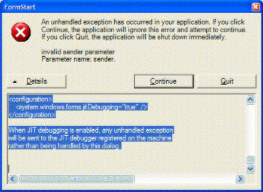

.NET applications can sometimes produce a stack trace of an error, these error messages are all we need to figure out what has happened.  <strong style="font-family:arial, sans-serif;font-size:14px;line-height:20.02px;">Please do not send us this screen shot</strong>, instead, select the top section of what's within this box and paste it in an email that you can send back to us. 

 <excerpt class='endintro'></excerpt> 

The text within the 'Details' button is more useful for debugging and locating the problem.
<dl class="image" style="margin-top:0px;margin-bottom:20px;box-sizing:border-box;font-family:arial, sans-serif;font-size:14px;line-height:20.02px;"><dt style="box-sizing:border-box;line-height:1.42857;"></dt><dd style="line-height:1.42857;box-sizing:border-box;">Figure: Bug details window</dd></dl>
See the end of this message for details on invoking  just-in-time (JIT) debugging instead of this dialog box.  We really want this part: ************** Exception Text ************** System.ArgumentException: invalid sender parameter Parameter name: sender at WindowsApplication3.FormStart.button5_Click(Object sender, EventArgs e) in c:\datajohnliu\datavs7projects\windowsapplication3\formstart.cs:line 143 at System.Windows.Forms.Control.OnClick(EventArgs e) at System.Windows.Forms.Button.OnClick(EventArgs e) at System.Windows.Forms.Button.OnMouseUp(MouseEventArgs mevent) at System.Windows.Forms.Control.WmMouseUp(Message& m, MouseButtons button, Int32 clicks) at System.Windows.Forms.Control.WndProc(Message& m) at System.Windows.Forms.ButtonBase.WndProc(Message& m) at System.Windows.Forms.Button.WndProc(Message& m) at System.Windows.Forms.ControlNativeWindow.OnMessage(Message& m) at System.Windows.Forms.ControlNativeWindow.WndProc(Message& m) at System.Windows.Forms.NativeWindow.Callback(IntPtr hWnd, Int32 msg, IntPtr wparam, IntPtr lparam)  This part is quite useful sometimes too. ************** Loaded Assemblies ************** mscorlib Assembly Version: 1.0.3300.0 Win32 Version: 1.0.3705.288 CodeBase: file:///c:/windows/microsoft.net/framework/ v1.0.3705/mscorlib.dll ---------------------------------------- WindowsApplication3 Assembly Version: 1.0.1129.31301 Win32 Version: 1.0.1129.31301 CodeBase: file:///C:/DataJohnLiu/DataVS7Projects/ WindowsApplication3/bin/Debug/WindowsApplication3.exe ---------------------------------------- System.Windows.Forms Assembly Version: 1.0.3300.0 Win32 Version: 1.0.3705.288 CodeBase: file:///c:/windows/assembly/gac/system.windows.forms/ 1.0.3300.0__b77a5c561934e089/system.windows.forms.dll ---------------------------------------- System Assembly Version: 1.0.3300.0 Win32 Version: 1.0.3705.288 CodeBase: file:///c:/windows/assembly/gac/system/ 1.0.3300.0__b77a5c561934e089/system.dll ---------------------------------------- System.Drawing Assembly Version: 1.0.3300.0 Win32 Version: 1.0.3705.288 CodeBase: file:///c:/windows/assembly/gac/system.drawing/ 1.0.3300.0__b03f5f7f11d50a3a/system.drawing.dll ---------------------------------------- System.Xml Assembly Version: 1.0.3300.0 Win32 Version: 1.0.3705.288 CodeBase: file:///c:/windows/assembly/gac/system.xml/ 1.0.3300.0__b77a5c561934e089/system.xml.dll ----------------------------------------  These are not really useful ************** JIT Debugging ************** To enable just in time (JIT) debugging, the config file for this application or machine (machine.config) must have the jitDebugging value set in the system.windows.forms section. The application must also be compiled with debugging enabled.  For example:  &lt;configuration&gt; &lt;system.windows.forms jitDebugging="true" /&gt; &lt;/configuration&gt;  When JIT debugging is enabled, any unhandled exception will be sent to the JIT debugger registered on the machine rather than being handled by this dialog.​

