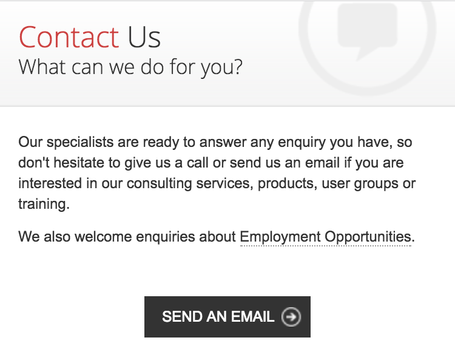
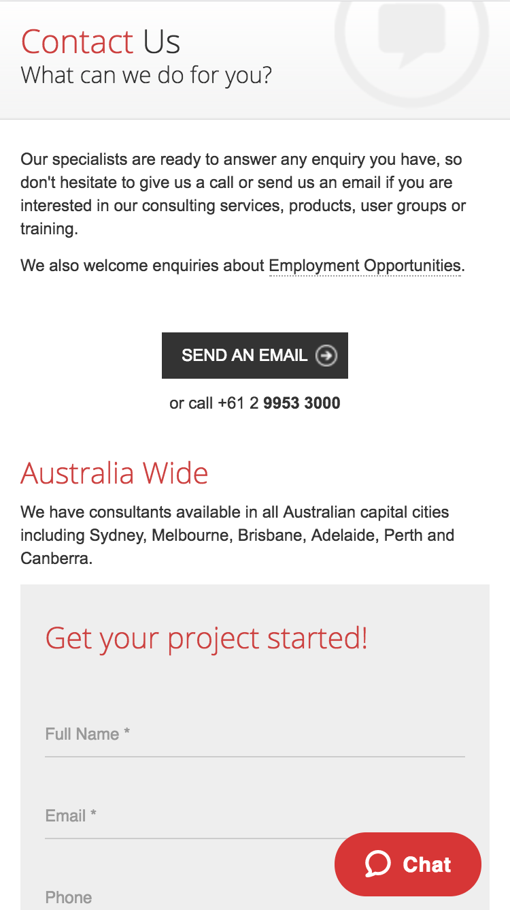

The evolution of website development can be summarized by: 

* 1990 - Cool website – content focus (static HTML content)
* 1995 - Cool graphics – interface focus (dynamic HTML content)
* 2000 - Nice flow – usability focus (focus on user experience)
* 2005 - Good marketing – conversion focus (SEO and visitors to customers conversion)
* 2010 - Happy customer– interactions focus (customer experience)

<!--endintro-->

It's important that your website is focused on CX (Customer Experience) which means you need modern contact options.

::: bad  
  
:::

::: good  
  
:::

`youtube: https://www.youtube.com/embed/K1HlAsW1RiA`
 
::: good
Zendesk explain how you can use mulitple channels of support to give your customers a better CX
:::
