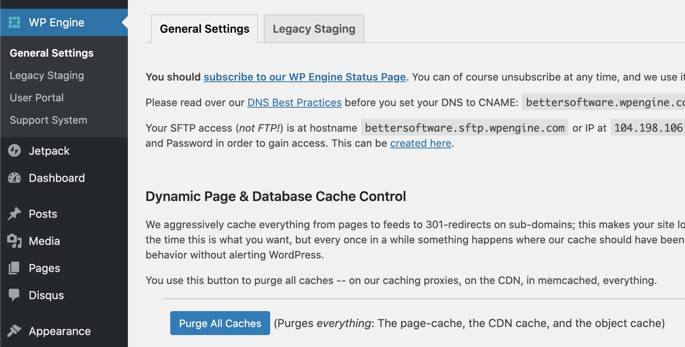

Extensive caching can complicate things if you’re working on your site and expecting to see changes immediately on the frontend. Purging cache is an essential part of the development process. 
 <excerpt class='endintro'></excerpt> 

​WPEngine - After you make a change on any WordPress site:

<ul><li>Log in to your website’s wp-admin dashboard</li><li>Click on the WP Engine plugin tab</li><li>Scroll down, click Purge All Caches ​</li></ul><dl class="image"><dt></dt><dd>Figure: Make sure you "Purge All Caches​" after making changes - This will allow others to see the changes immediately </dd></dl>
More information: <a href="https://wpengine.com/support/cache/#Purge_Server_Caches">https://wpengine.com/support/cache/#Purge_Server_Caches</a> 

