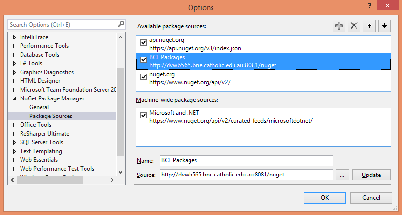
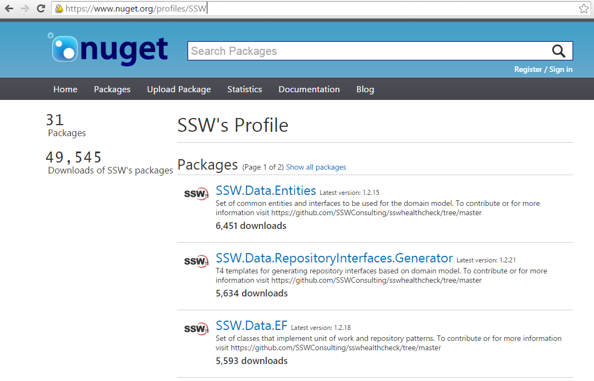

A common mistake is to use code or emails that you have previously written, and stored somewhere on your computer, and change around key bits to make it relevant for the current situation.

The problem with this is that you make it impossible for anyone else in your organization to do the same task to the same quality level.

<!--endintro-->

Make sure your company has a common code base and email template store and endeavour to improve it regularly. This shares knowledge across your organization and makes sure everyone is working to the level that your company standards require.

### Create Nuget Packages for reusable code libraries

The best approach to reuse code across multiple projects is to create Nuget Packages. When you need to update that library, it is then trivial to apply that update to your client projects.

::: good

:::

For details on creating your own internal Nuget repository, read [Do you create a private repository for reusable internal code?](/do-you-create-a-private-repository-for-reusable-internal-code)

::: good

:::

See a [selection of Nuget packages published by SSW](https://www.nuget.org/profiles/SSW).
