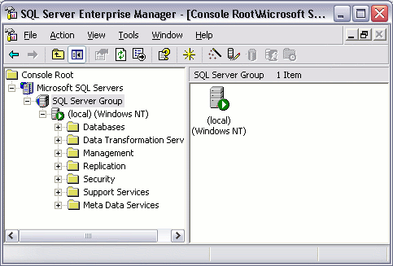
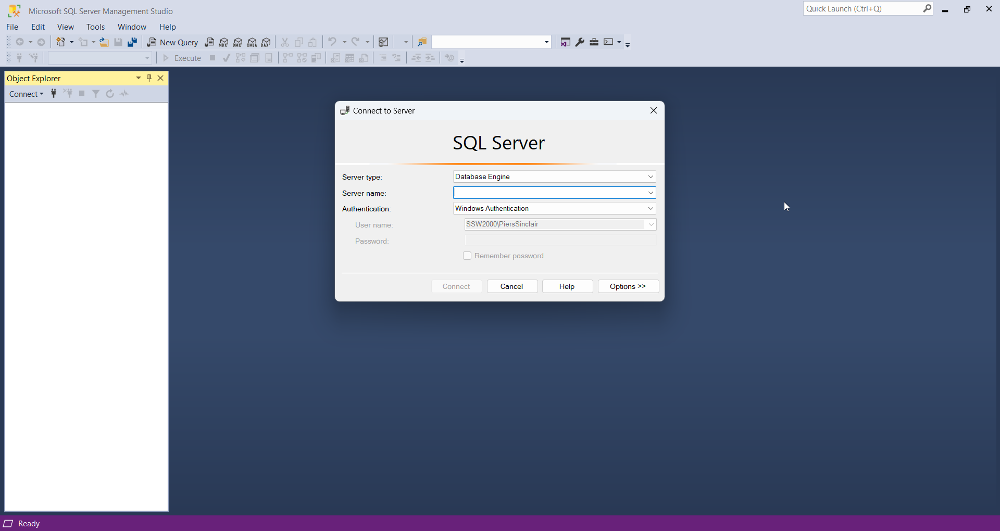
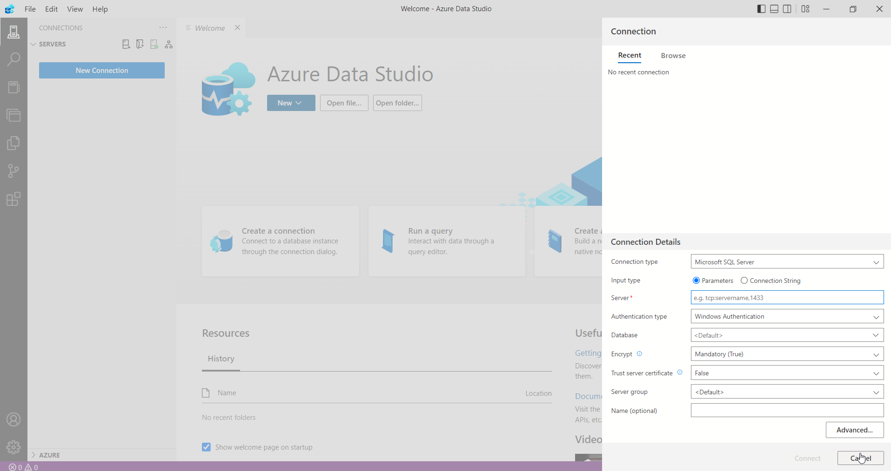
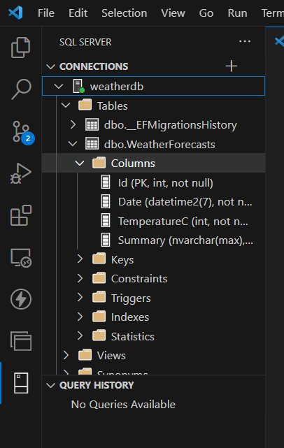

There are lots of ways to retrieve data in SQL Server. In the old days, SQL Server Enterprise Manager was the way to go.

These days, it has been replaced by several other tools: 

* [SQL Server Management Studio](https://learn.microsoft.com/en-us/sql/ssms/download-sql-server-management-studio-ssms?view=sql-server-ver16)
* [Azure Data Studio](https://learn.microsoft.com/en-us/sql/azure-data-studio/download-azure-data-studio?view=sql-server-ver16&tabs=redhat-install%2Credhat-uninstall)
* [VS Code MSSQL Extension](https://marketplace.visualstudio.com/items?itemName=ms-mssql.mssql)

<!--endintro-->

## SQL Server Management Studio (SSMS)

### Pros
✅ Mature tool with rich feature set, tailored specifically for SQL Server.

✅ Offers full-fledged management capabilities, from querying to administration tasks.

✅ Has built-in SQL Server specific features, like Profiler and SQL Server Agent.

### Cons
❌ Windows-only software, can't be used on macOS or Linux.

❌ UI can be clunky and outdated compared to newer tools.

❌ May be overkill for simple query execution and data exploration.

## Azure Data Studio

### Pros
✅ Cross-platform (Windows, macOS, and Linux).

✅ Modern UI with customizable dashboard.

✅ Notebooks support (SQL and Python), enabling better documentation and interactive analysis.

### Cons
❌ Less mature, so it might lack some advanced features compared to SSMS.

❌ Primarily designed for Azure SQL databases, though it supports on-premises SQL Server.

❌ Some users might find its user experience less intuitive than SSMS.

## VS Code with the MSSQL extension

## Pros
✅ Lightweight and cross-platform.

✅ Excellent if you're already using VS Code for other development tasks.

### Cons

❌ Not as feature-rich as SSMS or Azure Data Studio when it comes to SQL Server specific tasks.

::: bad

:::

::: good

:::

::: good

:::

::: good

:::
